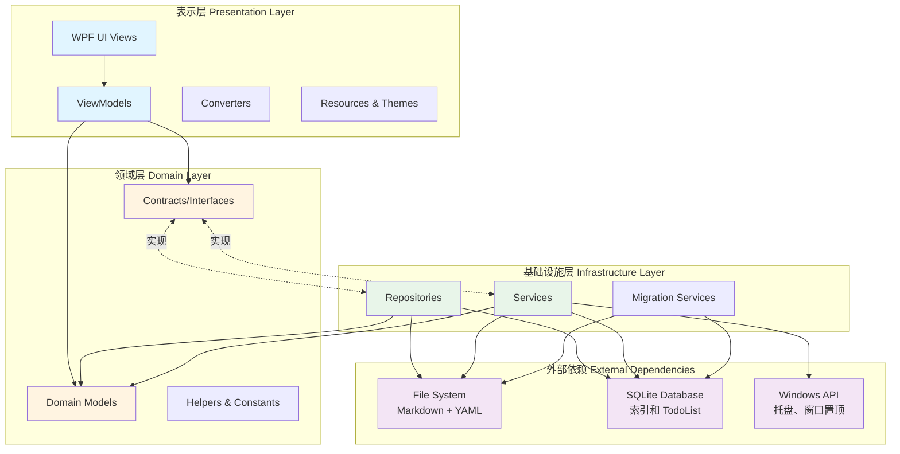
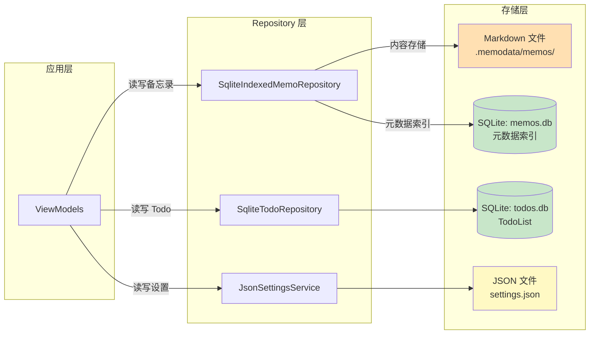

# DesktopMemo 项目架构图

## 1. 整体系统架构

本项目采用**三层架构**设计，遵循**MVVM 模式**和**依赖倒置原则 (DIP)**。



## 2. 项目结构

```
DesktopMemo_rebuild/
├── src/
│   ├── DesktopMemo.App/          # 表示层 (WPF 应用)
│   ├── DesktopMemo.Core/         # 领域层 (纯 .NET 库)
│   └── DesktopMemo.Infrastructure/ # 基础设施层
├── docs/                         # 文档
├── artifacts/                    # 构建输出
└── .memodata/                    # 运行时数据目录
    ├── memos/                    # Markdown 文件存储
    ├── settings.json             # 应用设置
    ├── memos.db                  # SQLite 备忘录索引
    ├── todos.db                  # SQLite TodoList
    └── logs/                     # 日志文件
```

## 3. 三层架构详解

### 3.1 表示层 (DesktopMemo.App)

**职责**：UI 呈现和用户交互

**主要组件**：
- **Views/**: WPF 窗口和用户控件 (MainWindow.xaml)
- **ViewModels/**: MVVM 视图模型 (MainViewModel, TodoListViewModel, LogViewModel)
- **Converters/**: 值转换器 (布尔转可见性等)
- **Resources/**: 主题、样式、本地化资源
- **Services/**: UI 层特定服务 (TrayService, WindowService)
- **Localization/**: 多语言支持

**依赖**：
- DesktopMemo.Core
- DesktopMemo.Infrastructure
- CommunityToolkit.Mvvm (MVVM 框架)
- Microsoft.Extensions.DependencyInjection (依赖注入)

### 3.2 领域层 (DesktopMemo.Core)

**职责**：定义业务模型和契约接口，不包含具体实现

**主要组件**：
- **Models/**: 领域模型 (Memo, TodoItem, WindowSettings, LogEntry)
- **Contracts/**: 接口定义 (IMemoRepository, ISettingsService, ILogService 等)
- **Helpers/**: 辅助类 (DebounceHelper, TransparencyHelper)
- **Constants/**: 常量定义

**特点**：
- 纯 .NET 库 (无 Windows 特定依赖)
- 不依赖其他项目
- 使用 CommunityToolkit.Mvvm (用于 ObservableObject)

### 3.3 基础设施层 (DesktopMemo.Infrastructure)

**职责**：实现领域层定义的接口，处理数据持久化和系统服务

**主要组件**：

#### Repositories (数据访问)
- **SqliteIndexedMemoRepository**: 备忘录存储 (Markdown + SQLite 索引)
- **SqliteTodoRepository**: TodoList 存储 (SQLite)
- **JsonSettingsService**: 设置存储 (JSON)

#### Services (业务服务)
- **MemoSearchService**: 备忘录全文搜索
- **FileLogService**: 文件日志记录
- **WindowService**: 窗口管理 (置顶、透明度)
- **TrayService**: 系统托盘

#### Migration Services (数据迁移)
- **MemoMigrationService**: 历史版本备忘录迁移
- **TodoMigrationService**: JSON → SQLite 迁移
- **MemoMetadataMigrationService**: index.json → SQLite 迁移

**依赖**：
- DesktopMemo.Core
- Dapper (轻量级 ORM)
- Microsoft.Data.Sqlite (SQLite 驱动)
- Markdig (Markdown 解析)
- System.Text.Json (JSON 序列化)

## 4. 依赖注入配置

在 `App.xaml.cs` 中配置的服务：

```csharp
// 核心数据服务
services.AddSingleton<ILogService, FileLogService>()
services.AddSingleton<IMemoRepository, SqliteIndexedMemoRepository>()
services.AddSingleton<ITodoRepository, SqliteTodoRepository>()
services.AddSingleton<ISettingsService, JsonSettingsService>()
services.AddSingleton<IMemoSearchService, MemoSearchService>()

// 数据迁移服务
services.AddSingleton<MemoMigrationService>()
services.AddSingleton<TodoMigrationService>()
services.AddSingleton<MemoMetadataMigrationService>()

// UI 服务
services.AddSingleton<IWindowService, WindowService>()
services.AddSingleton<ITrayService, TrayService>()
services.AddSingleton<ILocalizationService, LocalizationService>()

// ViewModels
services.AddSingleton<MainViewModel>()
services.AddSingleton<TodoListViewModel>()
services.AddSingleton<LogViewModel>()
```

## 5. 数据存储架构



### 存储设计特点

1. **备忘录**：双存储设计
   - Markdown 文件：存储完整内容 (便于版本控制、外部编辑)
   - SQLite 索引：存储元数据 (ID, 标题, 预览, 标签, 时间戳)

2. **TodoList**：完全使用 SQLite
   - 支持复杂查询和排序
   - 事务保证数据一致性

3. **设置**：JSON 文件
   - 人类可读
   - 易于手动修改和备份

## 6. 关键设计模式

### 6.1 MVVM (Model-View-ViewModel)
- **View**: XAML 定义的 UI
- **ViewModel**: 继承 `ObservableObject`，使用 `CommunityToolkit.Mvvm`
- **Model**: Core 层的领域模型

### 6.2 Repository 模式
- 抽象数据访问逻辑
- 接口定义在 Core 层，实现在 Infrastructure 层

### 6.3 依赖注入 (DI)
- 使用 `Microsoft.Extensions.DependencyInjection`
- 所有服务都通过构造函数注入

### 6.4 异步编程模式
- 避免 `async void`，使用 `Task.Run` 的 fire-and-forget 模式
- UI 操作在 UI 线程，IO 操作在后台线程

## 7. 架构优势

1. **分层清晰**：职责分离，易于维护和测试
2. **依赖倒置**：Core 层定义接口，Infrastructure 层实现，降低耦合
3. **可测试性**：通过接口依赖，易于 Mock 和单元测试
4. **可扩展性**：新功能可通过新增接口和实现类添加
5. **数据安全**：双存储设计，Markdown 文件作为数据源，SQLite 作为索引

## 8. 核心模块

| 模块 | 职责 | 关键类 |
|------|------|--------|
| **备忘录管理** | 创建、编辑、删除备忘录 | MainViewModel, SqliteIndexedMemoRepository |
| **TodoList** | 任务管理 | TodoListViewModel, SqliteTodoRepository |
| **搜索功能** | 全文搜索、标签筛选 | MemoSearchService |
| **设置管理** | 主题、语言、窗口设置 | JsonSettingsService, WindowService |
| **日志系统** | 应用日志记录和查看 | FileLogService, LogViewModel |
| **系统托盘** | 最小化到托盘、快捷操作 | TrayService |
| **数据迁移** | 版本升级数据迁移 | MemoMigrationService, TodoMigrationService |

## 9. 外部依赖说明

### 必需依赖
- **.NET 9.0**: 目标框架
- **WPF**: Windows 桌面 UI 框架
- **SQLite**: 嵌入式数据库

### 第三方库
- **CommunityToolkit.Mvvm**: MVVM 框架 (属性通知、命令绑定)
- **Markdig**: Markdown 解析和渲染
- **Dapper**: 轻量级 ORM
- **Microsoft.Extensions.DependencyInjection**: 依赖注入容器
- **System.Text.Json**: JSON 序列化

### Windows API
- **Win32 API**: 窗口置顶 (SetWindowPos)、点击穿透 (WS_EX_TRANSPARENT)
- **System.Windows.Forms**: 系统托盘 (NotifyIcon)

## 10. 容易出问题的模块

根据架构分析，以下模块需要特别关注：

1. **数据迁移服务** ⚠️
   - 涉及文件系统和数据库操作
   - 版本升级时容易出现数据丢失或损坏
   - 位置: `DesktopMemo.Infrastructure/Services/*MigrationService.cs`

2. **异步操作** ⚠️
   - WPF 中 `async void` 容易导致死锁
   - 需严格遵循 fire-and-forget 模式
   - 位置: MainViewModel 中的事件处理

3. **SQLite 并发** ⚠️
   - SQLite 不支持高并发写入
   - 需注意锁和事务管理
   - 位置: Repository 实现类

4. **设置保存** ⚠️
   - 频繁修改设置可能导致性能问题
   - 使用 DebounceHelper 防抖
   - 位置: MainViewModel 设置相关属性

5. **托盘服务初始化** ⚠️
   - Windows 系统托盘可能初始化失败
   - 已有异常处理，但需监控
   - 位置: App.xaml.cs:130-135

---

**文档版本**: 1.0
**最后更新**: 2025-11-15
**维护者**: 项目开发团队
