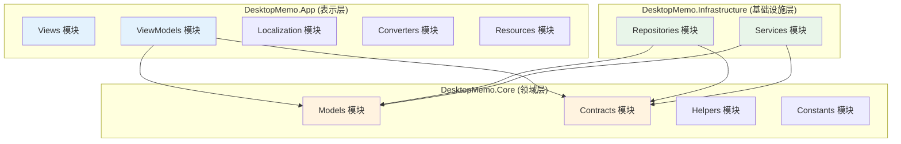
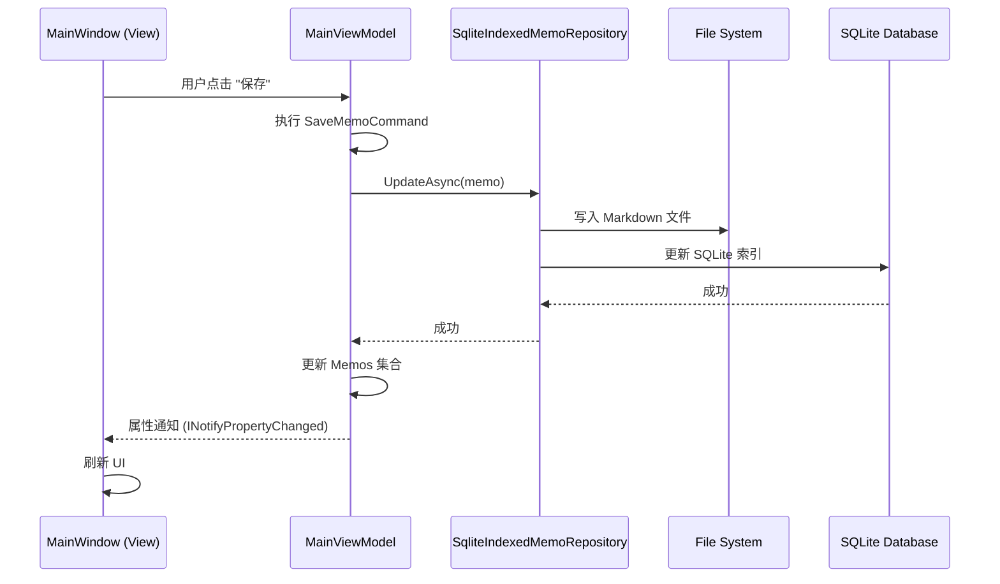
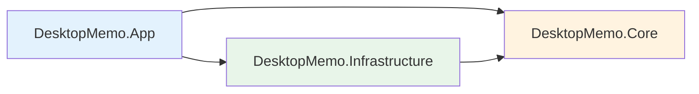

# DesktopMemo 模块划分详解

## 1. 模块总览

本项目按照**三层架构**和**领域驱动设计 (DDD)** 思想进行模块划分：



---

## 2. 表示层 (DesktopMemo.App)

### 2.1 Views 模块

**职责**: 定义用户界面

**主要文件**:
- `MainWindow.xaml` / `MainWindow.xaml.cs` - 主窗口
- 用户控件 (如果有)

**特点**:
- 使用 WPF XAML 语法
- 通过数据绑定连接到 ViewModel
- 不包含业务逻辑
- 负责 UI 事件处理 (如窗口拖拽、按钮点击)

---

### 2.2 ViewModels 模块

**职责**: 实现表示逻辑，连接 View 和 Model

**核心类**:

#### MainViewModel
- **路径**: `ViewModels/MainViewModel.cs`
- **职责**:
  - 备忘录列表管理
  - 编辑状态管理
  - 设置管理
  - 窗口状态控制
- **关键属性**:
  - `Memos`: 备忘录集合
  - `SelectedMemo`: 当前选中备忘录
  - `EditorContent`: 编辑器内容
  - `WindowSettings`: 窗口设置
  - `IsEditMode`: 编辑模式标志
- **关键命令**:
  - `CreateMemoCommand`: 创建备忘录
  - `DeleteMemoCommand`: 删除备忘录
  - `SaveMemoCommand`: 保存备忘录
  - `ToggleSettingsPanelCommand`: 切换设置面板

#### TodoListViewModel
- **路径**: `ViewModels/TodoListViewModel.cs`
- **职责**: TodoList 功能管理
- **关键属性**:
  - `TodoItems`: 任务集合
  - `CompletedTodoItems`: 已完成任务
- **关键命令**:
  - `AddTodoCommand`: 添加任务
  - `ToggleTodoCommand`: 切换任务状态
  - `DeleteTodoCommand`: 删除任务

#### LogViewModel
- **路径**: `ViewModels/LogViewModel.cs`
- **职责**: 日志查看和过滤
- **关键属性**:
  - `LogEntries`: 日志条目集合
  - `FilterLevel`: 日志级别过滤器
- **关键功能**:
  - 实时加载日志
  - 按级别过滤
  - 清空日志

**技术特点**:
- 继承 `ObservableObject` (CommunityToolkit.Mvvm)
- 使用 `[ObservableProperty]` 自动生成属性通知
- 使用 `[RelayCommand]` 自动生成命令
- 通过依赖注入获取服务

---

### 2.3 Localization 模块

**职责**: 多语言支持

**主要组件**:
- `LocalizationService.cs` - 本地化服务实现
- `Resources/` - 语言资源文件 (如 `Strings.zh-CN.json`, `Strings.en-US.json`)

**支持的语言**:
- 简体中文 (zh-CN)
- English (en-US)
- 更多语言可扩展

**工作原理**:
- 从 JSON 文件加载翻译
- 通过 `ILocalizationService` 接口提供翻译
- 支持运行时切换语言

---

### 2.4 Converters 模块

**职责**: 值转换器 (用于数据绑定)

**典型转换器**:
- `BooleanToVisibilityConverter` - 布尔值转可见性
- `InverseBooleanConverter` - 布尔值取反
- `DateTimeToStringConverter` - 日期时间格式化

---

### 2.5 Resources 模块

**职责**: 主题、样式、图标等资源

**主要文件**:
- `App.xaml` - 全局资源字典
- `Resources/Themes/` - 主题定义 (浅色、深色)
- `../images/logo.ico` - 应用图标

---

## 3. 领域层 (DesktopMemo.Core)

### 3.1 Models 模块

**职责**: 定义业务实体

**核心实体**:

#### Memo (备忘录)
```csharp
public sealed record Memo(
    Guid Id,
    string Title,
    string Content,
    string Preview,
    DateTimeOffset CreatedAt,
    DateTimeOffset UpdatedAt,
    IReadOnlyList<string> Tags,
    bool IsPinned,
    int Version,
    SyncStatus SyncStatus,
    DateTimeOffset? DeletedAt
)
```
- **不可变对象** (使用 `record` 关键字)
- **方法**: `CreateNew()`, `WithContent()`, `WithMetadata()`
- **计算属性**: `DisplayTitle` (智能提取标题)

#### TodoItem (待办任务)
```csharp
public record TodoItem(
    Guid Id,
    string Content,
    bool IsCompleted,
    DateTimeOffset CreatedAt,
    DateTimeOffset? CompletedAt
)
```

#### WindowSettings (窗口设置)
- 窗口位置、大小
- 透明度、置顶模式
- 主题、语言

#### LogEntry (日志条目)
- 日志级别 (Debug, Info, Warning, Error)
- 时间戳
- 来源、消息、异常

**枚举类型**:
- `AppTheme`: 主题 (Light, Dark, Auto)
- `SyncStatus`: 同步状态 (Synced, PendingSync, Conflict)
- `LogLevel`: 日志级别

---

### 3.2 Contracts 模块

**职责**: 定义接口契约

**核心接口**:

#### 数据访问接口
- `IMemoRepository` - 备忘录仓储
  ```csharp
  Task<IReadOnlyList<Memo>> GetAllAsync()
  Task<Memo?> GetByIdAsync(Guid id)
  Task AddAsync(Memo memo)
  Task UpdateAsync(Memo memo)
  Task DeleteAsync(Guid id)
  ```

- `ITodoRepository` - 待办任务仓储
- `ISettingsService` - 设置服务
  ```csharp
  Task<WindowSettings> LoadAsync()
  Task SaveAsync(WindowSettings settings)
  ```

#### 业务服务接口
- `IMemoSearchService` - 搜索服务
  ```csharp
  Task<IReadOnlyList<Memo>> SearchAsync(string keyword)
  Task<IReadOnlyList<Memo>> GetByTagAsync(string tag)
  ```

- `ILogService` - 日志服务
  ```csharp
  void Debug(string source, string message)
  void Info(string source, string message)
  void Warning(string source, string message)
  void Error(string source, string message, Exception? ex)
  ```

#### UI 服务接口
- `IWindowService` - 窗口管理服务
  ```csharp
  void SetTopmost(bool topmost)
  void SetTransparency(double opacity)
  void SetClickThrough(bool enabled)
  ```

- `ITrayService` - 系统托盘服务
  ```csharp
  void Initialize()
  void Show()
  void Hide()
  ```

- `ILocalizationService` - 本地化服务
  ```csharp
  string GetString(string key)
  void ChangeLanguage(string languageCode)
  ```

---

### 3.3 Helpers 模块

**职责**: 辅助工具类

**核心工具**:

#### DebounceHelper
- **用途**: 防抖动 (延迟执行)
- **场景**: 设置保存、搜索输入
- **示例**:
  ```csharp
  _debouncer.Debounce(500, async () => await SaveSettingsAsync());
  ```

#### TransparencyHelper
- **用途**: 计算窗口透明度
- **功能**: 百分比 ↔ 不透明度值转换

---

### 3.4 Constants 模块

**职责**: 定义系统常量

**主要常量**:
- `WindowConstants` - 窗口相关常量
  - 默认宽度、高度
  - 最小宽度、高度
  - 置顶模式枚举

---

## 4. 基础设施层 (DesktopMemo.Infrastructure)

### 4.1 Repositories 模块

**职责**: 数据访问实现

**核心实现**:

#### SqliteIndexedMemoRepository
- **路径**: `Repositories/SqliteIndexedMemoRepository.cs`
- **实现接口**: `IMemoRepository`
- **存储方式**:
  - **Markdown 文件**: 完整内容
    - 格式: YAML Front Matter + Markdown Body
    - 位置: `.memodata/memos/{id}.md`
  - **SQLite 索引**: 元数据
    - 表: `memos`
    - 字段: id, title, preview, created_at, updated_at, tags, is_pinned
- **关键技术**:
  - 使用 Dapper 查询 SQLite
  - 使用 File I/O 读写 Markdown
  - 双写策略 (先写文件，后写索引)

#### SqliteTodoRepository
- **路径**: `Repositories/SqliteTodoRepository.cs`
- **实现接口**: `ITodoRepository`
- **存储方式**: 完全使用 SQLite
  - 表: `todos`
  - 支持事务

#### JsonSettingsService
- **路径**: `Services/JsonSettingsService.cs`
- **实现接口**: `ISettingsService`
- **存储方式**: JSON 文件 (`.memodata/settings.json`)
- **序列化**: `System.Text.Json`

---

### 4.2 Services 模块

**职责**: 业务服务实现

**核心服务**:

#### MemoSearchService
- **路径**: `Services/MemoSearchService.cs`
- **实现接口**: `IMemoSearchService`
- **功能**:
  - 全文搜索 (标题 + 内容)
  - 标签筛选
  - 组合查询 (SQLite FTS 或 LIKE)

#### FileLogService
- **路径**: `Services/FileLogService.cs`
- **实现接口**: `ILogService`
- **功能**:
  - 写入日志到文件
  - 按日期滚动 (`.memodata/logs/app-2025-11-15.log`)
  - 异步写入 (避免阻塞 UI)

#### WindowService
- **路径**: `Services/WindowService.cs`
- **实现接口**: `IWindowService`
- **功能**:
  - 设置窗口置顶 (调用 Win32 API `SetWindowPos`)
  - 设置窗口透明度 (WPF `Opacity` 属性)
  - 设置点击穿透 (Win32 API `WS_EX_TRANSPARENT`)

#### TrayService
- **路径**: `Services/TrayService.cs`
- **实现接口**: `ITrayService`
- **功能**:
  - 创建系统托盘图标 (使用 `System.Windows.Forms.NotifyIcon`)
  - 托盘菜单 (显示/隐藏窗口、退出应用)
  - 双击托盘图标恢复窗口

#### 数据迁移服务
- **MemoMigrationService**: 历史版本备忘录格式迁移
- **TodoMigrationService**: JSON → SQLite 迁移
- **MemoMetadataMigrationService**: index.json → SQLite 索引迁移

**特点**:
- 启动时自动检测并执行
- 迁移成功后保留旧文件作为备份
- 记录迁移日志

---

## 5. 模块间通信



---

## 6. 模块依赖关系

### 依赖规则
1. **表示层** 可以依赖 **领域层** 和 **基础设施层**
2. **基础设施层** 可以依赖 **领域层**
3. **领域层** 不依赖任何其他层 (纯 POCO)

### 依赖图


---

## 7. 模块职责矩阵

| 模块 | 创建 | 读取 | 更新 | 删除 | 搜索 | 渲染 |
|------|------|------|------|------|------|------|
| **ViewModels** | ✅ | ✅ | ✅ | ✅ | ✅ | ❌ |
| **Views** | ❌ | ❌ | ❌ | ❌ | ❌ | ✅ |
| **Repositories** | ✅ | ✅ | ✅ | ✅ | ✅ | ❌ |
| **Services** | ❌ | ✅ | ❌ | ❌ | ✅ | ❌ |
| **Models** | ❌ | ❌ | ❌ | ❌ | ❌ | ❌ |

---

## 8. 模块扩展指南

### 添加新功能的步骤

#### 示例: 添加 "备忘录分类" 功能

1. **定义领域模型** (Core/Models)
   ```csharp
   public record Category(Guid Id, string Name, string Color);
   ```

2. **定义接口** (Core/Contracts)
   ```csharp
   public interface ICategoryRepository
   {
       Task<IReadOnlyList<Category>> GetAllAsync();
       Task AddAsync(Category category);
   }
   ```

3. **实现仓储** (Infrastructure/Repositories)
   ```csharp
   public class SqliteCategoryRepository : ICategoryRepository
   {
       // 实现接口方法
   }
   ```

4. **注册服务** (App.xaml.cs)
   ```csharp
   services.AddSingleton<ICategoryRepository, SqliteCategoryRepository>();
   ```

5. **添加 ViewModel** (App/ViewModels)
   ```csharp
   public partial class CategoryViewModel : ObservableObject
   {
       private readonly ICategoryRepository _categoryRepository;
       // ...
   }
   ```

6. **创建视图** (App/Views)
   - 添加 `CategoryManagementView.xaml`

---

## 9. 模块维护建议

### 最核心模块 ⭐
1. **MainViewModel** - 应用核心逻辑
2. **SqliteIndexedMemoRepository** - 数据存储
3. **App.xaml.cs** - 依赖注入配置

### 需要重点测试的模块 🧪
1. **Repositories** - 数据正确性
2. **Migration Services** - 升级兼容性
3. **WindowService** - 跨 Windows 版本兼容性

### 性能敏感模块 ⚡
1. **MemoSearchService** - 大量备忘录时的搜索性能
2. **FileLogService** - 日志写入不应阻塞 UI
3. **MainViewModel** - 防抖动设置保存

---

**文档版本**: 1.0
**最后更新**: 2025-11-15
**维护者**: 项目开发团队
