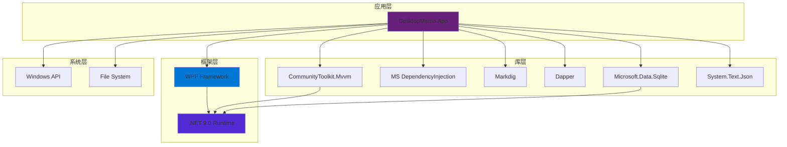

# DesktopMemo 技术栈和依赖说明

## 1. 技术栈总览

```mermaid
graph TB
    subgraph "开发平台"
        NET[.NET 9.0]
        LANG[C# 13.0]
    end

    subgraph "UI 框架"
        WPF[WPF - Windows Presentation Foundation]
        XAML[XAML 标记语言]
        MVVM[MVVM Toolkit]
    end

    subgraph "数据存储"
        SQLite[SQLite 数据库]
        MD[Markdown 文件]
        JSON[JSON 配置文件]
    end

    subgraph "第三方库"
        CT[CommunityToolkit.Mvvm]
        Dapper[Dapper ORM]
        Markdig[Markdig Markdown]
        DI[MS DependencyInjection]
    end

    NET --> WPF
    WPF --> XAML
    WPF --> MVVM
    MVVM --> CT
    NET --> SQLite
    NET --> MD
    NET --> JSON
    NET --> Dapper
    NET --> Markdig
    NET --> DI

    style NET fill:#512bd4
    style WPF fill:#0078d4
    style SQLite fill:#003b57
    style CT fill:#68217a
```



---

## 2. 核心技术栈

### 2.1 .NET 9.0

**选择理由**:
- 最新的长期支持 (LTS) 版本
- 性能提升和新语言特性
- 更好的垃圾回收 (GC) 性能
- 原生 AOT 支持 (未来优化选项)

**使用特性**:
- C# 13.0 新特性
- `record` 类型 (不可变数据模型)
- `async/await` 异步编程
- `nullable` 引用类型 (提高代码安全性)
- `ImplicitUsings` (隐式全局引用)

**运行环境**:
- **目标平台**: Windows (net9.0-windows)
- **最低要求**: Windows 10 / Windows 11
- **架构**: x64, x86, ARM64

---

### 2.2 WPF (Windows Presentation Foundation)

**版本**: 随 .NET 9.0 发布的版本

**选择理由**:
- Windows 原生桌面应用框架
- 强大的数据绑定和 MVVM 支持
- 丰富的 UI 控件和样式
- 硬件加速渲染 (DirectX)

**使用的 WPF 特性**:
- 数据绑定 (Binding, INotifyPropertyChanged)
- 命令系统 (ICommand)
- 资源字典和样式 (ResourceDictionary, Style)
- 附加属性 (Attached Properties)
- 依赖属性 (Dependency Properties)

**UI 组件**:
- `Window` - 主窗口
- `TextBox` - 编辑器
- `ListBox` / `ListView` - 备忘录列表
- `Button`, `CheckBox`, `Slider` - 控件
- `Border`, `Grid`, `StackPanel` - 布局

---

### 2.3 MVVM 架构

**框架**: CommunityToolkit.Mvvm (v8.4.0)

**核心组件**:
- `ObservableObject` - 属性通知基类
- `[ObservableProperty]` - 源生成器自动生成属性
- `[RelayCommand]` - 源生成器自动生成命令
- `ObservableCollection<T>` - 可观察集合

**示例**:
```csharp
public partial class MainViewModel : ObservableObject
{
    [ObservableProperty]
    private string _editorContent = string.Empty;

    [RelayCommand]
    private async Task SaveMemoAsync()
    {
        // 保存逻辑
    }
}
```

**优势**:
- 减少样板代码
- 编译时代码生成 (性能优)
- 类型安全
- 易于测试

---

## 3. 第三方库依赖

### 3.1 NuGet 包依赖清单

| 包名 | 版本 | 用途 | 使用位置 |
|------|------|------|----------|
| **CommunityToolkit.Mvvm** | 8.4.0 | MVVM 框架 | App, Core |
| **Markdig** | 0.42.0 | Markdown 解析 | App, Infrastructure |
| **Dapper** | 2.1.35 | 轻量级 ORM | Infrastructure |
| **Microsoft.Data.Sqlite** | 9.0.1 | SQLite 驱动 | Infrastructure |
| **Microsoft.Extensions.DependencyInjection** | 9.0.9 | 依赖注入容器 | App |
| **Microsoft.Extensions.Logging.Abstractions** | 9.0.9 | 日志抽象 | Infrastructure |
| **System.Text.Json** | 9.0.9 | JSON 序列化 | Infrastructure |

---

### 3.2 核心依赖详解

#### CommunityToolkit.Mvvm

**GitHub**: https://github.com/CommunityToolkit/dotnet

**功能**:
- 源生成器 (Source Generators) 自动生成 MVVM 代码
- `ObservableObject`, `ObservableRecipient`
- `RelayCommand`, `AsyncRelayCommand`
- `ObservableValidator` (验证支持)

**使用场景**:
- 所有 ViewModel 继承 `ObservableObject`
- 使用 `[ObservableProperty]` 声明属性
- 使用 `[RelayCommand]` 声明命令

**替代方案**:
- Prism (更重型)
- MVVM Light (已停止维护)
- 手写 INotifyPropertyChanged (繁琐)

---

#### Dapper

**官网**: https://github.com/DapperLib/Dapper

**功能**:
- 微型 ORM (性能接近原生 ADO.NET)
- 对象映射 (将查询结果映射到 C# 对象)
- 支持参数化查询 (防止 SQL 注入)

**使用场景**:
```csharp
var memos = await connection.QueryAsync<Memo>(
    "SELECT * FROM memos WHERE is_pinned = @IsPinned",
    new { IsPinned = true }
);
```

**优势**:
- 性能高 (几乎无性能损耗)
- 简单易用 (无需复杂配置)
- 适合轻量级应用

**替代方案**:
- Entity Framework Core (功能强大但重型)
- ADO.NET (原生但繁琐)

---

#### Markdig

**GitHub**: https://github.com/xoofx/markdig

**功能**:
- Markdown → HTML 转换
- 支持 CommonMark 和 GitHub Flavored Markdown
- 扩展语法 (表格、任务列表、表情符号)

**使用场景**:
- 解析备忘录 Markdown 内容
- 提取 YAML Front Matter

**优势**:
- 性能优秀 (比 MarkdownSharp 快 10 倍)
- 可扩展 (支持自定义扩展)

**替代方案**:
- MarkdownSharp (老旧)
- CommonMark.NET (功能较少)

---

#### Microsoft.Data.Sqlite

**官方文档**: https://learn.microsoft.com/en-us/dotnet/standard/data/sqlite/

**功能**:
- 官方 SQLite ADO.NET 驱动
- 支持 Entity Framework Core
- 原生 .NET 集成

**使用场景**:
```csharp
using var connection = new SqliteConnection($"Data Source={dbPath}");
await connection.OpenAsync();
await connection.ExecuteAsync("CREATE TABLE IF NOT EXISTS memos...");
```

**优势**:
- 官方支持
- 嵌入式数据库 (无需独立进程)
- 跨平台 (虽然此项目仅支持 Windows)

**替代方案**:
- System.Data.SQLite (社区维护)
- SQLite-net (适用于移动端)

---

#### Microsoft.Extensions.DependencyInjection

**官方文档**: https://learn.microsoft.com/en-us/dotnet/core/extensions/dependency-injection

**功能**:
- .NET 官方依赖注入容器
- 支持构造函数注入
- 生命周期管理 (Singleton, Scoped, Transient)

**使用场景** (App.xaml.cs):
```csharp
var services = new ServiceCollection();
services.AddSingleton<IMemoRepository, SqliteIndexedMemoRepository>();
services.AddSingleton<MainViewModel>();
var serviceProvider = services.BuildServiceProvider();
```

**优势**:
- 官方支持
- 与 ASP.NET Core 一致
- 轻量级

**替代方案**:
- Autofac (功能更强大)
- Ninject (老牌 DI 容器)

---

#### System.Text.Json

**官方文档**: https://learn.microsoft.com/en-us/dotnet/standard/serialization/system-text-json/

**功能**:
- .NET 官方 JSON 序列化库
- 高性能 (基于 Span<T> 优化)
- 原生支持异步

**使用场景**:
```csharp
var settings = await JsonSerializer.DeserializeAsync<WindowSettings>(stream);
await JsonSerializer.SerializeAsync(stream, settings, new JsonSerializerOptions
{
    WriteIndented = true
});
```

**优势**:
- 官方支持
- 性能优于 Newtonsoft.Json
- 内置于 .NET

**替代方案**:
- Newtonsoft.Json (功能更全但性能较低)

---

## 4. 数据存储技术

### 4.1 SQLite

**版本**: 通过 Microsoft.Data.Sqlite 9.0.1 引入的最新稳定版

**使用场景**:
1. **备忘录元数据索引** (`memos.db`)
   - 表: `memos`
   - 字段: id, title, preview, created_at, updated_at, tags, is_pinned

2. **TodoList** (`todos.db`)
   - 表: `todos`
   - 字段: id, content, is_completed, created_at, completed_at

**数据库架构**:
```sql
-- memos.db
CREATE TABLE memos (
    id TEXT PRIMARY KEY,
    title TEXT NOT NULL,
    preview TEXT,
    created_at TEXT NOT NULL,
    updated_at TEXT NOT NULL,
    tags TEXT,
    is_pinned INTEGER DEFAULT 0
);

-- todos.db
CREATE TABLE todos (
    id TEXT PRIMARY KEY,
    content TEXT NOT NULL,
    is_completed INTEGER DEFAULT 0,
    created_at TEXT NOT NULL,
    completed_at TEXT
);
```

**优势**:
- 无需独立数据库服务器
- 单文件存储
- 支持事务 (ACID)
- 全文搜索 (FTS5)

---

### 4.2 Markdown 文件

**格式**: YAML Front Matter + Markdown Body

**示例**:
```markdown
---
id: 550e8400-e29b-41d4-a716-446655440000
title: 我的备忘录
created_at: 2025-11-15T10:00:00+08:00
updated_at: 2025-11-15T10:30:00+08:00
tags:
  - 工作
  - 重要
is_pinned: true
---

# 标题

这是备忘录内容...
```

**存储位置**: `.memodata/memos/{id}.md`

**优势**:
- 人类可读
- 支持版本控制 (Git)
- 可用外部 Markdown 编辑器编辑
- 数据安全 (即使 SQLite 损坏，数据仍在)

---

### 4.3 JSON 配置文件

**文件**: `.memodata/settings.json`

**内容**:
```json
{
  "windowWidth": 800,
  "windowHeight": 600,
  "windowLeft": 100,
  "windowTop": 100,
  "backgroundOpacity": 0.8,
  "theme": "Light",
  "preferredLanguage": "zh-CN",
  "isAutoStartEnabled": false,
  "topmostMode": "Desktop"
}
```

**优势**:
- 人类可读
- 易于手动修改
- 备份简单 (复制文件)

---

## 5. Windows API 调用

### 5.1 Win32 API

**使用场景**:

#### 窗口置顶 (SetWindowPos)
```csharp
[DllImport("user32.dll")]
private static extern bool SetWindowPos(IntPtr hWnd, IntPtr hWndInsertAfter,
    int X, int Y, int cx, int cy, uint uFlags);
```
- 实现 "桌面级置顶" 和 "普通置顶"

#### 点击穿透 (扩展窗口样式)
```csharp
[DllImport("user32.dll")]
private static extern int SetWindowLong(IntPtr hWnd, int nIndex, int dwNewLong);
```
- 设置 `WS_EX_TRANSPARENT` 样式

---

### 5.2 System.Windows.Forms

**使用场景**: 系统托盘

**组件**:
- `NotifyIcon` - 托盘图标
- `ContextMenuStrip` - 右键菜单

**代码位置**: `Infrastructure/Services/TrayService.cs`

---

## 6. 开发工具和环境

### 6.1 IDE 和编辑器

**推荐**:
- Visual Studio 2022 (v17.12+)
- Visual Studio Code + C# Dev Kit
- JetBrains Rider

**必需组件**:
- .NET 9.0 SDK
- WPF 工作负载

---

### 6.2 构建工具

**构建命令**:
```powershell
dotnet restore
dotnet build --configuration Release
dotnet publish -c Release -r win-x64 --self-contained
```

**发布工具**:
- `build_exe.bat` - 单文件可执行文件发布脚本

---

### 6.3 版本控制

**工具**: Git

**忽略文件**: `.gitignore`
- `bin/`, `obj/`, `artifacts/`
- `.memodata/` (用户数据)
- `.vs/` (Visual Studio 配置)

---

## 7. 技术栈依赖关系图



---

## 8. 外部服务和 API

### 8.1 当前使用的外部依赖

**无外部网络依赖** ✅
- 所有数据存储在本地
- 无云服务集成
- 无第三方 API 调用

### 8.2 潜在的未来扩展

**云同步** (预留设计):
- `SyncStatus` 枚举已定义 (Synced, PendingSync, Conflict)
- `Memo.Version` 字段支持版本控制
- 可集成 OneDrive, Dropbox, 或自建服务

**第三方 API**:
- Markdown 渲染服务 (如 GitHub API)
- AI 摘要生成 (如 OpenAI API)

---

## 9. 技术债务和未来升级计划

### 9.1 已知技术债务

无重大技术债务 ✅

### 9.2 未来升级计划

1. **Markdown 编辑器增强**
   - 集成富文本编辑器 (如 AvalonEdit)
   - 实时预览

2. **全文搜索优化**
   - 使用 SQLite FTS5 (全文搜索扩展)
   - 支持拼音搜索

3. **性能优化**
   - 虚拟化列表 (大量备忘录时)
   - 延迟加载

4. **跨平台**
   - 使用 Avalonia UI (支持 macOS, Linux)

---

## 10. 技术选型对比

| 需求 | 选择的技术 | 替代方案 | 选择理由 |
|------|-----------|---------|---------|
| **UI 框架** | WPF | WinUI 3, Avalonia | 成熟稳定，资料丰富 |
| **MVVM 框架** | CommunityToolkit.Mvvm | Prism, MVVM Light | 官方支持，源生成器 |
| **数据库** | SQLite | LiteDB, JSON 文件 | 标准 SQL，性能好 |
| **ORM** | Dapper | EF Core, ADO.NET | 轻量高性能 |
| **Markdown** | Markdig | CommonMark.NET | 功能全，性能好 |
| **DI 容器** | MS DI | Autofac, Ninject | 官方支持，轻量 |

---

**最后更新**: 2025-11-15
