# DesktopMemo 数据流和通信机制

## 1. 数据流总览

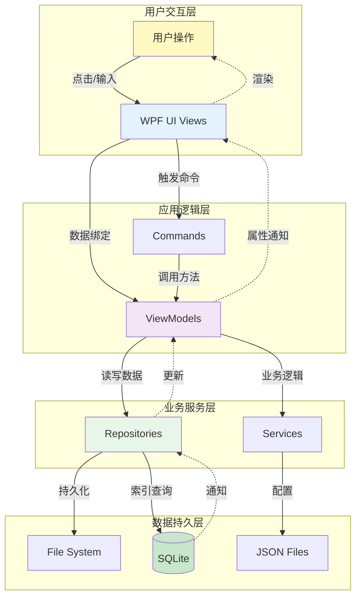

---

## 2. 核心数据流场景

### 2.1 应用启动流程

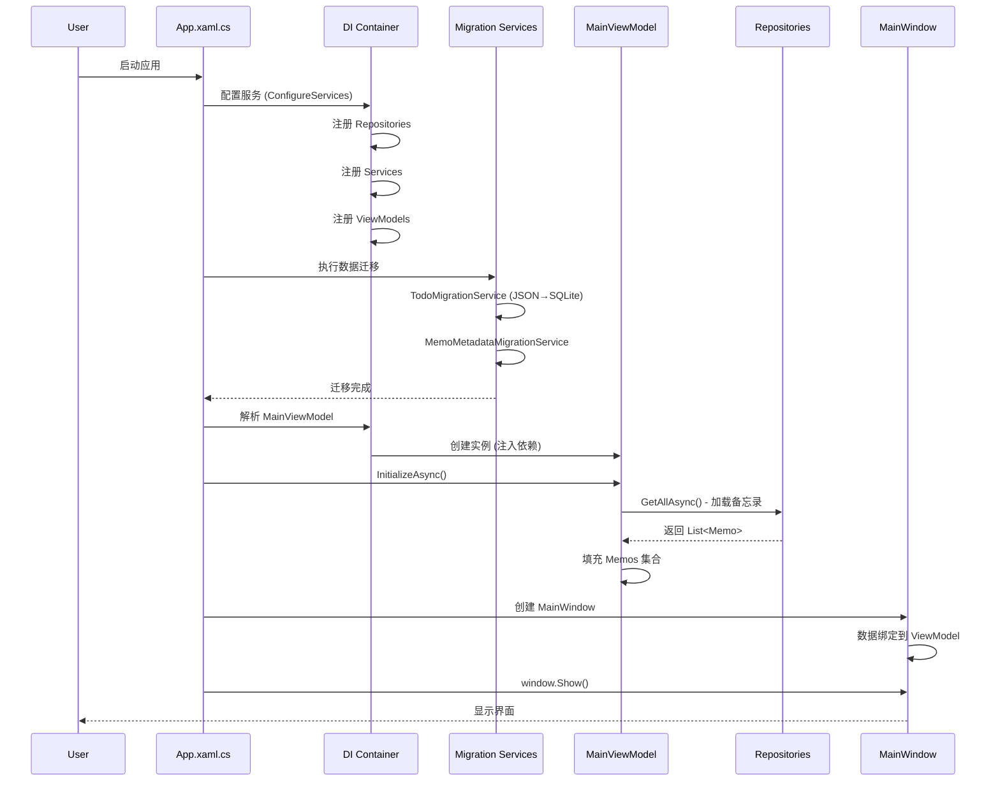

**关键步骤**:
1. **依赖注入配置** (App.xaml.cs:23-54)
2. **数据迁移检查** (App.xaml.cs:73-101)
3. **ViewModel 初始化** (MainViewModel.InitializeAsync)
4. **加载备忘录列表** (从 Repository)
5. **窗口显示**

**数据来源**:
- 备忘录: `.memodata/memos/*.md` + `memos.db`
- 设置: `.memodata/settings.json`
- TodoList: `todos.db`

---

### 2.2 创建新备忘录流程

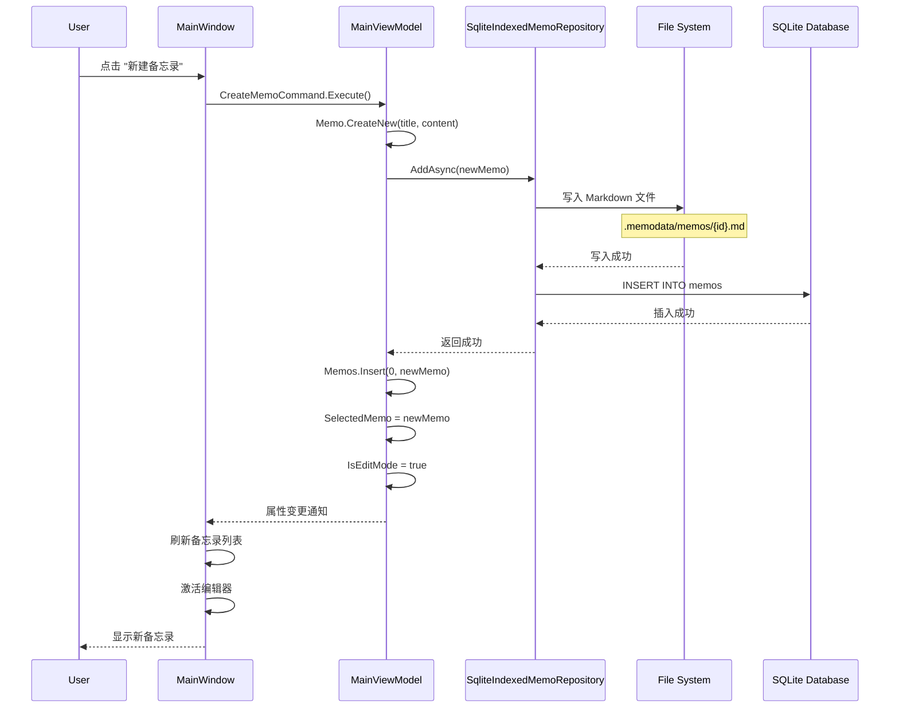

**数据流向**:
1. **UI → ViewModel**: 命令触发
2. **ViewModel → Repository**: 调用 AddAsync
3. **Repository → File System**: 写入 Markdown 文件
4. **Repository → SQLite**: 插入元数据索引
5. **Repository → ViewModel**: 返回成功
6. **ViewModel → UI**: 属性通知 (INotifyPropertyChanged)

**涉及的文件**:
- `MainViewModel.cs:CreateMemoCommand` (命令)
- `SqliteIndexedMemoRepository.cs:AddAsync` (数据访问)
- `.memodata/memos/{guid}.md` (Markdown 文件)
- `.memodata/memos.db` (SQLite 索引)

---

### 2.3 编辑备忘录流程

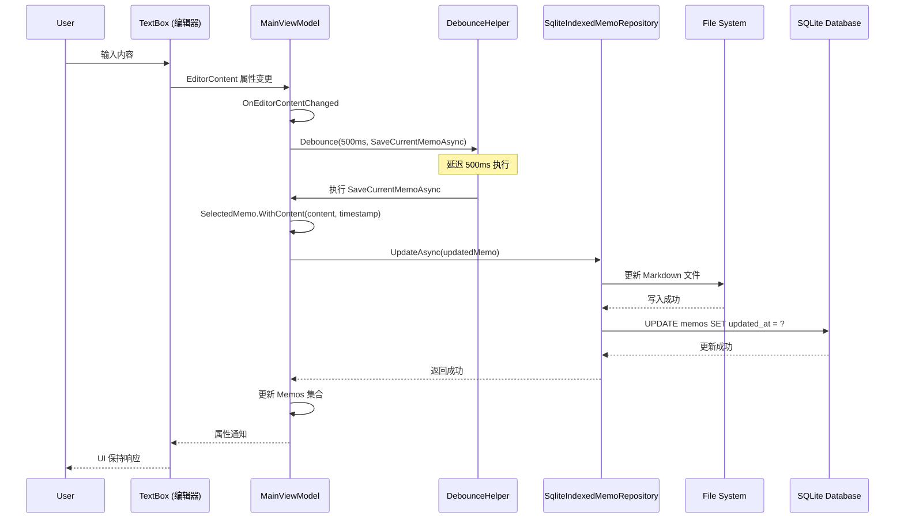

**防抖策略**:
- **延迟**: 500ms
- **目的**: 避免频繁保存 (性能优化)
- **实现**: DebounceHelper (Core/Helpers/DebounceHelper.cs)

**数据同步**:
- **编辑器内容** (`EditorContent`) ← 用户输入
- **备忘录对象** (`SelectedMemo`) ← 内存中的数据模型
- **Markdown 文件** ← 持久化存储
- **SQLite 索引** ← 元数据同步

---

### 2.4 搜索备忘录流程

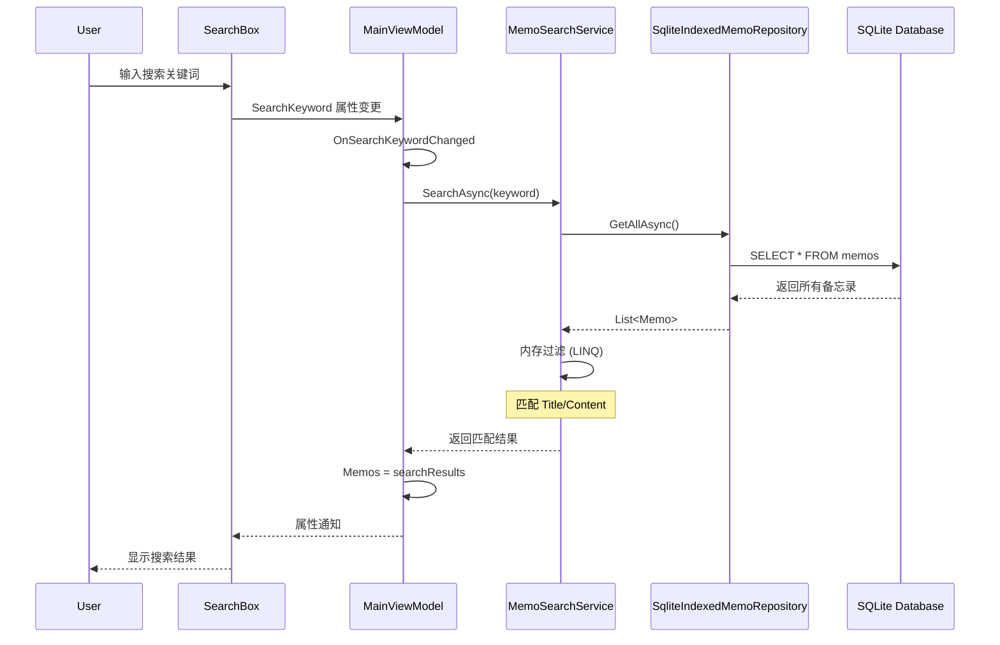

**搜索策略**:
1. **全量加载**: 从 Repository 获取所有备忘录
2. **内存过滤**: 使用 LINQ 在内存中过滤
3. **匹配规则**:
   - 标题包含关键词
   - 内容包含关键词
   - 标签包含关键词

**性能优化建议**:
- 使用 SQLite FTS5 (全文搜索扩展)
- 仅加载元数据 (Title, Preview)
- 延迟加载完整内容

---

### 2.5 设置保存流程

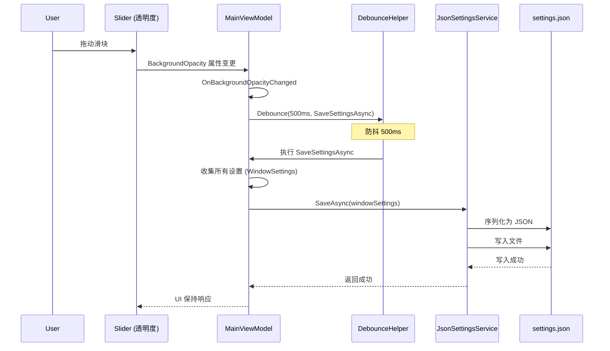

**设置类型**:
- **窗口属性**: 位置、大小、透明度
- **应用设置**: 主题、语言、自动启动
- **置顶模式**: 桌面级、普通、不置顶

**防抖原因**:
- 滑块拖动会频繁触发属性变更
- 避免每次变更都写文件 (IO 操作昂贵)
- 500ms 延迟后才执行保存

**原子性保证**:
```csharp
// 先写临时文件，成功后覆盖原文件
var tempPath = settingsPath + ".tmp";
await File.WriteAllTextAsync(tempPath, json);
File.Move(tempPath, settingsPath, overwrite: true);
```

---

### 2.6 TodoList 数据流

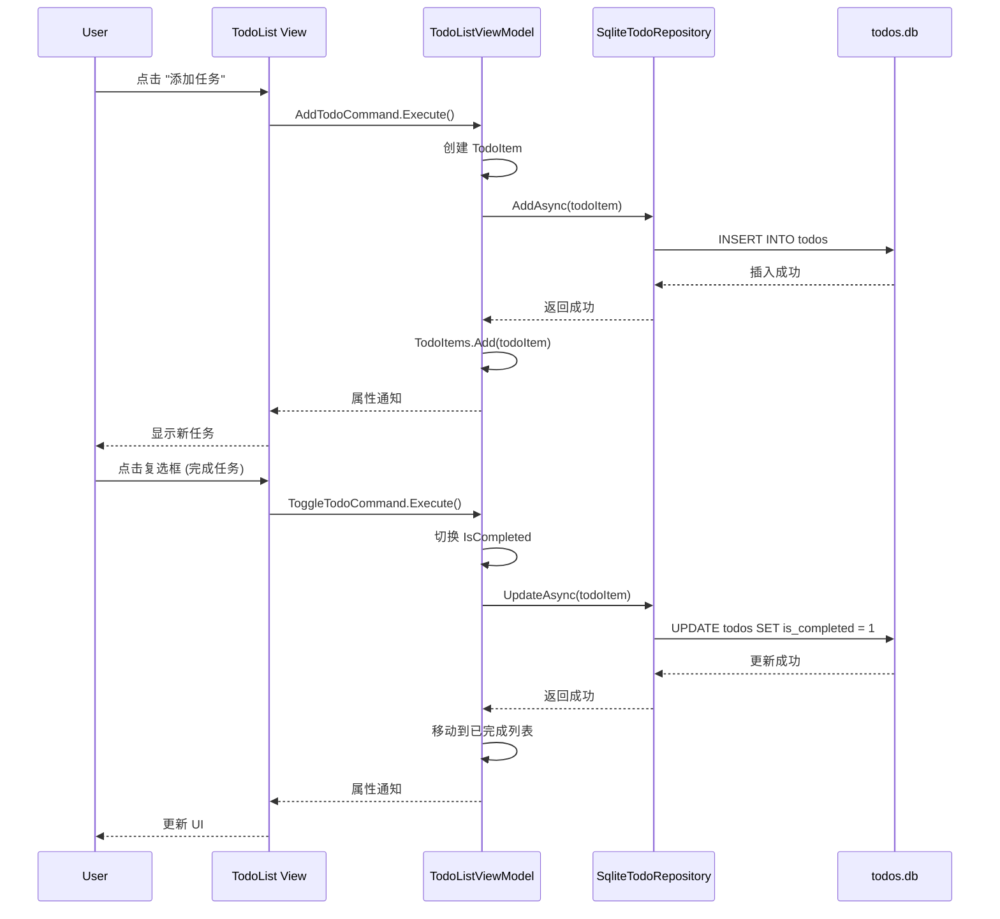

**数据流特点**:
- **完全 SQLite 存储** (不使用文件)
- **事务支持** (保证数据一致性)
- **双列表管理**:
  - `TodoItems`: 未完成任务
  - `CompletedTodoItems`: 已完成任务

---

## 3. 数据存储策略

### 3.1 备忘录双存储设计

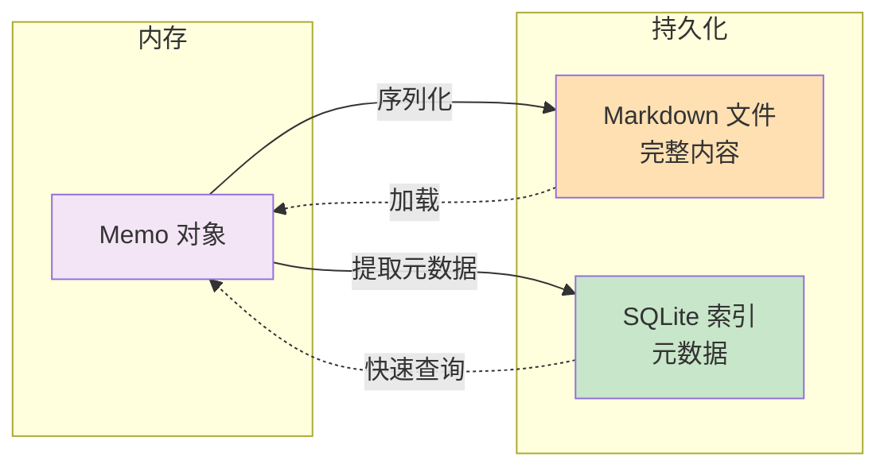

**为什么双存储?**

1. **Markdown 文件** (数据源):
   - ✅ 人类可读
   - ✅ 支持版本控制 (Git)
   - ✅ 可用外部编辑器
   - ✅ 数据安全 (即使 SQLite 损坏)
   - ❌ 查询慢 (需遍历文件)

2. **SQLite 索引** (性能优化):
   - ✅ 查询快速 (SQL)
   - ✅ 支持排序、筛选
   - ✅ 全文搜索 (FTS5)
   - ❌ 二进制格式 (不可直接编辑)

**同步策略**:
```csharp
// 写入流程
await File.WriteAllTextAsync(filePath, markdown); // 先写文件
await _db.ExecuteAsync("INSERT INTO memos...");   // 后写索引

// 读取流程
var metadata = await _db.QueryAsync<Memo>("SELECT * FROM memos"); // 从索引读
var content = await File.ReadAllTextAsync(filePath);              // 从文件读内容
```

---

### 3.2 数据一致性保证

**问题**: 如果 Markdown 文件写入成功，但 SQLite 插入失败怎么办?

**解决方案**:

#### 方案 1: 双写 + 回滚
```csharp
await File.WriteAllTextAsync(filePath, markdown);
try
{
    await _db.ExecuteAsync("INSERT INTO memos...");
}
catch
{
    File.Delete(filePath); // 回滚文件写入
    throw;
}
```

#### 方案 2: 启动时自动修复
```csharp
// 应用启动时检查
var filesOnDisk = Directory.GetFiles(".memodata/memos", "*.md");
var idsInDb = await _db.QueryAsync<string>("SELECT id FROM memos");

var missingInDb = filesOnDisk.Except(idsInDb);
foreach (var id in missingInDb)
{
    // 从 Markdown 文件重建索引
    var memo = await ParseMarkdownFile(id);
    await _db.ExecuteAsync("INSERT INTO memos...");
}
```

**当前实现**: 使用方案 1 (双写 + 异常处理)

---

### 3.3 并发控制

**问题**: 多个操作同时修改同一备忘录怎么办?

**当前策略**:
- **单线程 UI**: WPF 主线程处理所有 UI 操作
- **无并发冲突**: 用户一次只能编辑一个备忘录

**未来扩展** (云同步场景):
- 使用 `Version` 字段进行乐观并发控制
- 检测冲突: `WHERE id = ? AND version = ?`
- 冲突解决: 标记为 `SyncStatus.Conflict`

---

## 4. 异步数据流

### 4.1 异步编程模式

**规则**: 避免 `async void`，使用 fire-and-forget

**错误示例**:
```csharp
private async void Button_Click(object sender, RoutedEventArgs e)
{
    await SaveMemoAsync(); // ❌ 可能导致死锁
}
```

**正确示例**:
```csharp
private void Button_Click(object sender, RoutedEventArgs e)
{
    _ = Task.Run(async () => await SaveMemoAsync()); // ✅ Fire-and-forget
}
```

**ViewModel 中的异步命令**:
```csharp
[RelayCommand]
private async Task SaveMemoAsync() // ✅ 返回 Task
{
    await _repository.UpdateAsync(SelectedMemo);
}
```

---

### 4.2 线程切换

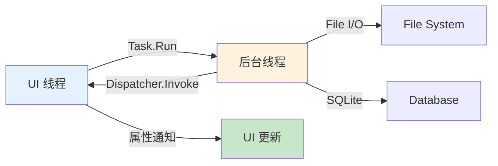

**示例**:
```csharp
// UI 线程 → 后台线程
private async Task LoadMemosAsync()
{
    var memos = await Task.Run(async () =>
        await _repository.GetAllAsync()); // 后台线程执行 I/O

    // 自动回到 UI 线程 (ObservableCollection 内部处理)
    Memos = new ObservableCollection<Memo>(memos);
}
```

---

## 5. 事件驱动数据流

### 5.1 属性变更通知

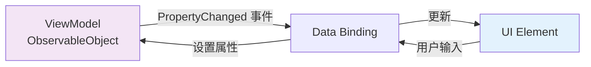

**实现原理**:
```csharp
public partial class MainViewModel : ObservableObject
{
    [ObservableProperty]
    private string _editorContent = string.Empty;

    // 编译器生成:
    public string EditorContent
    {
        get => _editorContent;
        set
        {
            if (_editorContent != value)
            {
                _editorContent = value;
                OnPropertyChanged(nameof(EditorContent)); // 触发事件
            }
        }
    }
}
```

**XAML 绑定**:
```xml
<TextBox Text="{Binding EditorContent, UpdateSourceTrigger=PropertyChanged}" />
```

---

### 5.2 集合变更通知

**ObservableCollection**:
```csharp
public ObservableCollection<Memo> Memos { get; } = new();

// 自动触发 UI 更新
Memos.Add(newMemo);         // UI 添加项
Memos.Remove(oldMemo);      // UI 移除项
Memos[0] = updatedMemo;     // UI 更新项
```

**内部原理**:
- 实现 `INotifyCollectionChanged` 接口
- 触发 `CollectionChanged` 事件
- WPF 数据绑定自动监听并更新 UI

---

## 6. 数据流中的关键设计模式

### 6.1 Repository 模式

**目的**: 封装数据访问逻辑

```csharp
// 接口定义 (Core 层)
public interface IMemoRepository
{
    Task<IReadOnlyList<Memo>> GetAllAsync();
    Task AddAsync(Memo memo);
}

// 实现 (Infrastructure 层)
public class SqliteIndexedMemoRepository : IMemoRepository
{
    public async Task<IReadOnlyList<Memo>> GetAllAsync()
    {
        // 从 SQLite + Markdown 加载
    }
}

// 使用 (App 层)
public class MainViewModel
{
    private readonly IMemoRepository _repository;

    public MainViewModel(IMemoRepository repository)
    {
        _repository = repository;
    }
}
```

---

### 6.2 单向数据流

```mermaid
graph TB
    User[用户操作] -->|1. 触发| Command[Command]
    Command -->|2. 调用| VM[ViewModel 方法]
    VM -->|3. 更新| Model[数据模型]
    Model -->|4. 持久化| Storage[存储层]
    Storage -.5. 返回.-> VM
    VM -.6. 属性通知.-> UI[UI 更新]
    UI -.7. 渲染.-> User

    style User fill:#fff9c4
    style Command fill:#f3e5f5
    style VM fill:#e1bee7
    style Storage fill:#c8e6c9
    style UI fill:#e3f2fd
```

**优势**:
- 数据流向清晰
- 易于调试和测试
- 避免双向绑定的复杂性

---

### 6.3 防抖模式 (Debounce)

**目的**: 减少高频操作的执行次数

```csharp
// DebounceHelper.cs
public class DebounceHelper
{
    private CancellationTokenSource? _cts;

    public void Debounce(int delayMs, Action action)
    {
        _cts?.Cancel(); // 取消之前的延迟任务
        _cts = new CancellationTokenSource();

        Task.Delay(delayMs, _cts.Token)
            .ContinueWith(_ => action(),
                TaskScheduler.FromCurrentSynchronizationContext());
    }
}
```

**使用场景**:
- 编辑器内容自动保存 (500ms)
- 搜索框输入 (300ms)
- 设置滑块拖动 (500ms)

---

## 7. 数据流中的异常处理

### 7.1 分层异常处理

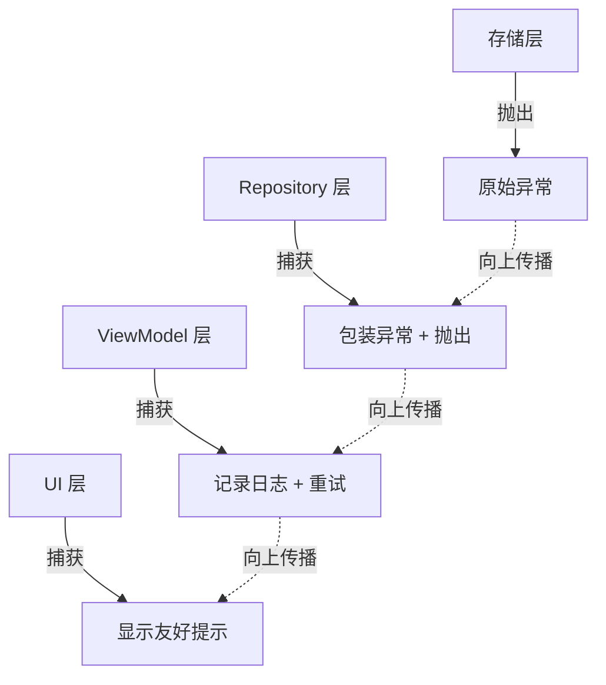

**示例**:
```csharp
// Repository 层
public async Task AddAsync(Memo memo)
{
    try
    {
        await File.WriteAllTextAsync(path, content);
    }
    catch (IOException ex)
    {
        throw new DataAccessException("无法写入备忘录文件", ex);
    }
}

// ViewModel 层
[RelayCommand]
private async Task SaveMemoAsync()
{
    try
    {
        await _repository.UpdateAsync(SelectedMemo);
    }
    catch (DataAccessException ex)
    {
        _logService.Error("MainViewModel", "保存失败", ex);
        // 通知用户
    }
}
```

---

## 8. 数据流性能优化

### 8.1 延迟加载

**策略**: 仅在需要时加载完整内容

```csharp
// 列表显示: 只加载元数据
var memos = await _db.QueryAsync<Memo>("SELECT id, title, preview FROM memos");

// 编辑时: 加载完整内容
var content = await File.ReadAllTextAsync($".memodata/memos/{id}.md");
```

---

### 8.2 虚拟化列表 (未实现)

**建议**: 当备忘录超过 1000 条时
```xml
<ListBox VirtualizingPanel.IsVirtualizing="True"
         VirtualizingPanel.VirtualizationMode="Recycling" />
```

---

### 8.3 缓存策略

**当前**: 内存缓存 (ObservableCollection)
```csharp
public ObservableCollection<Memo> Memos { get; } = new();
// 数据加载后一直保持在内存
```

**优化**: LRU 缓存 (未来)
- 仅缓存最近使用的 100 条
- 其他从数据库按需加载

---

## 9. 数据流安全性

### 9.1 SQL 注入防护

**使用参数化查询**:
```csharp
// ✅ 安全
await _db.ExecuteAsync(
    "INSERT INTO memos (id, title) VALUES (@Id, @Title)",
    new { Id = memo.Id, Title = memo.Title });

// ❌ 不安全
await _db.ExecuteAsync(
    $"INSERT INTO memos (id, title) VALUES ('{memo.Id}', '{memo.Title}')");
```

---

### 9.2 文件路径安全

**验证路径**:
```csharp
var fileName = $"{memo.Id}.md";
if (fileName.Contains("..") || fileName.Contains("/") || fileName.Contains("\\"))
{
    throw new SecurityException("非法文件名");
}
var fullPath = Path.Combine(_dataDirectory, "memos", fileName);
```

---

## 10. 数据流监控和调试

### 10.1 日志记录

**关键数据流节点**:
```csharp
_logService.Debug("MainViewModel", $"开始加载备忘录");
var memos = await _repository.GetAllAsync();
_logService.Info("MainViewModel", $"加载了 {memos.Count} 条备忘录");
```

**日志位置**: `.memodata/logs/app-{date}.log`

---

### 10.2 调试输出

```csharp
System.Diagnostics.Debug.WriteLine($"[MainViewModel] 保存备忘录: {memo.Id}");
```

**查看**: Visual Studio 输出窗口

---

## 11. 总结

### 核心数据流路径

1. **用户输入** → UI (WPF)
2. **UI** → ViewModel (数据绑定/命令)
3. **ViewModel** → Repository/Service (业务逻辑)
4. **Repository** → File System/SQLite (数据持久化)
5. **持久化成功** → ViewModel (返回结果)
6. **ViewModel** → UI (属性通知)
7. **UI** → 用户 (界面更新)

### 数据流设计原则

- ✅ **单向数据流**: 避免双向绑定的复杂性
- ✅ **分层架构**: 职责清晰，易于维护
- ✅ **依赖倒置**: 接口定义在 Core 层
- ✅ **异步优先**: 避免阻塞 UI 线程
- ✅ **防抖优化**: 减少高频操作
- ✅ **异常处理**: 分层捕获和处理
- ✅ **日志记录**: 关键节点记录日志

---

**文档版本**: 1.0
**最后更新**: 2025-11-15
**维护者**: 项目开发团队
