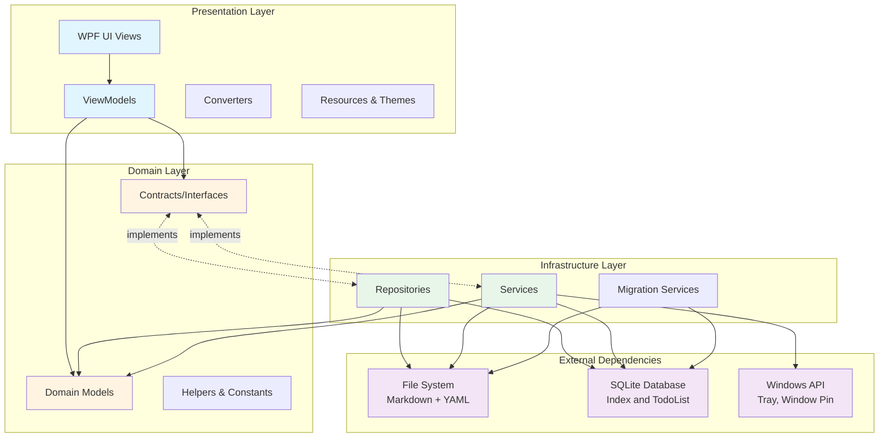
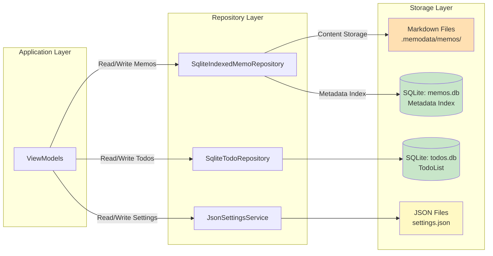

# DesktopMemo Project Architecture Diagram

## 1. Overall System Architecture

This project adopts a **three-layer architecture** design, following the **MVVM pattern** and **Dependency Inversion Principle (DIP)**.



## 2. Project Structure

```
DesktopMemo_rebuild/
├── src/
│   ├── DesktopMemo.App/          # Presentation Layer (WPF App)
│   ├── DesktopMemo.Core/         # Domain Layer (Pure .NET Library)
│   └── DesktopMemo.Infrastructure/ # Infrastructure Layer
├── docs/                         # Documentation
├── artifacts/                    # Build Output
└── .memodata/                    # Runtime Data Directory
    ├── memos/                    # Markdown File Storage
    ├── settings.json             # App Settings
    ├── memos.db                  # SQLite Memo Index
    ├── todos.db                  # SQLite TodoList
    └── logs/                     # Log Files
```

## 3. Three-Layer Architecture Details

### 3.1 Presentation Layer (DesktopMemo.App)

**Responsibility**: UI presentation and user interaction

**Main Components**:
- **Views/**: WPF windows and user controls (MainWindow.xaml)
- **ViewModels/**: MVVM view models (MainViewModel, TodoListViewModel, LogViewModel)
- **Converters/**: Value converters (Boolean to Visibility, etc.)
- **Resources/**: Themes, styles, localization resources
- **Services/**: UI-specific services (TrayService, WindowService)
- **Localization/**: Multi-language support

**Dependencies**:
- DesktopMemo.Core
- DesktopMemo.Infrastructure
- CommunityToolkit.Mvvm (MVVM framework)
- Microsoft.Extensions.DependencyInjection (DI)

### 3.2 Domain Layer (DesktopMemo.Core)

**Responsibility**: Define business models and contract interfaces, no implementation

**Main Components**:
- **Models/**: Domain models (Memo, TodoItem, WindowSettings, LogEntry)
- **Contracts/**: Interface definitions (IMemoRepository, ISettingsService, ILogService, etc.)
- **Helpers/**: Helper classes (DebounceHelper, TransparencyHelper)
- **Constants/**: Constant definitions

**Features**:
- Pure .NET library (no Windows-specific dependencies)
- No dependencies on other projects
- Uses CommunityToolkit.Mvvm (for ObservableObject)

### 3.3 Infrastructure Layer (DesktopMemo.Infrastructure)

**Responsibility**: Implement domain layer interfaces, handle data persistence and system services

**Main Components**:

#### Repositories (Data Access)
- **SqliteIndexedMemoRepository**: Memo storage (Markdown + SQLite index)
- **SqliteTodoRepository**: TodoList storage (SQLite)
- **JsonSettingsService**: Settings storage (JSON)

#### Services (Business Services)
- **MemoSearchService**: Memo full-text search
- **FileLogService**: File logging
- **WindowService**: Window management (pin, transparency)
- **TrayService**: System tray

#### Migration Services
- **MemoMigrationService**: Historical version memo migration
- **TodoMigrationService**: JSON → SQLite migration
- **MemoMetadataMigrationService**: index.json → SQLite migration

**Dependencies**:
- DesktopMemo.Core
- Dapper (lightweight ORM)
- Microsoft.Data.Sqlite (SQLite driver)
- Markdig (Markdown parsing)
- System.Text.Json (JSON serialization)

## 4. Dependency Injection Configuration

Services configured in `App.xaml.cs`:

```csharp
// Core data services
services.AddSingleton<ILogService, FileLogService>()
services.AddSingleton<IMemoRepository, SqliteIndexedMemoRepository>()
services.AddSingleton<ITodoRepository, SqliteTodoRepository>()
services.AddSingleton<ISettingsService, JsonSettingsService>()
services.AddSingleton<IMemoSearchService, MemoSearchService>()

// Migration services
services.AddSingleton<MemoMigrationService>()
services.AddSingleton<TodoMigrationService>()
services.AddSingleton<MemoMetadataMigrationService>()

// UI services
services.AddSingleton<IWindowService, WindowService>()
services.AddSingleton<ITrayService, TrayService>()
services.AddSingleton<ILocalizationService, LocalizationService>()

// ViewModels
services.AddSingleton<MainViewModel>()
services.AddSingleton<TodoListViewModel>()
services.AddSingleton<LogViewModel>()
```

## 5. Data Storage Architecture



### Storage Design Features

1. **Memos**: Dual storage design
   - Markdown files: Store complete content (easy version control, external editing)
   - SQLite index: Store metadata (ID, title, preview, tags, timestamps)

2. **TodoList**: Fully uses SQLite
   - Supports complex queries and sorting
   - Transactions ensure data consistency

3. **Settings**: JSON files
   - Human-readable
   - Easy manual modification and backup

## 6. Key Design Patterns

### 6.1 MVVM (Model-View-ViewModel)
- **View**: UI defined in XAML
- **ViewModel**: Inherits `ObservableObject`, uses `CommunityToolkit.Mvvm`
- **Model**: Domain models in Core layer

### 6.2 Repository Pattern
- Abstract data access logic
- Interfaces defined in Core layer, implementations in Infrastructure layer

### 6.3 Dependency Injection (DI)
- Uses `Microsoft.Extensions.DependencyInjection`
- All services injected through constructor

### 6.4 Async Programming Pattern
- Avoid `async void`, use fire-and-forget pattern with `Task.Run`
- UI operations on UI thread, IO operations on background thread

## 7. Architecture Advantages

1. **Clear Layers**: Separation of concerns, easy to maintain and test
2. **Dependency Inversion**: Core layer defines interfaces, Infrastructure implements, lower coupling
3. **Testability**: Interface dependencies make mocking and unit testing easy
4. **Extensibility**: New features can be added through new interfaces and implementations
5. **Data Safety**: Dual storage design, Markdown files as data source, SQLite as index

## 8. Core Modules

| Module | Responsibility | Key Classes |
|--------|---------------|-------------|
| **Memo Management** | Create, edit, delete memos | MainViewModel, SqliteIndexedMemoRepository |
| **TodoList** | Task management | TodoListViewModel, SqliteTodoRepository |
| **Search** | Full-text search, tag filtering | MemoSearchService |
| **Settings** | Theme, language, window settings | JsonSettingsService, WindowService |
| **Logging** | App logging and viewing | FileLogService, LogViewModel |
| **System Tray** | Minimize to tray, quick actions | TrayService |
| **Data Migration** | Version upgrade data migration | MemoMigrationService, TodoMigrationService |

## 9. External Dependencies

### Required Dependencies
- **.NET 9.0**: Target framework
- **WPF**: Windows desktop UI framework
- **SQLite**: Embedded database

### Third-Party Libraries
- **CommunityToolkit.Mvvm**: MVVM framework (property notification, command binding)
- **Markdig**: Markdown parsing and rendering
- **Dapper**: Lightweight ORM
- **Microsoft.Extensions.DependencyInjection**: DI container
- **System.Text.Json**: JSON serialization

### Windows API
- **Win32 API**: Window pinning (SetWindowPos), click-through (WS_EX_TRANSPARENT)
- **System.Windows.Forms**: System tray (NotifyIcon)

## 10. Problem-Prone Modules

Based on architecture analysis, the following modules require special attention:

1. **Data Migration Services** ⚠️
   - Involves file system and database operations
   - Easy to lose or corrupt data during version upgrades
   - Location: `DesktopMemo.Infrastructure/Services/*MigrationService.cs`

2. **Async Operations** ⚠️
   - `async void` in WPF can cause deadlocks
   - Must strictly follow fire-and-forget pattern
   - Location: Event handling in MainViewModel

3. **SQLite Concurrency** ⚠️
   - SQLite doesn't support high concurrent writes
   - Need to pay attention to locks and transaction management
   - Location: Repository implementation classes

4. **Settings Save** ⚠️
   - Frequent settings changes may cause performance issues
   - Use DebounceHelper for debouncing
   - Location: Settings-related properties in MainViewModel

5. **Tray Service Initialization** ⚠️
   - Windows system tray may fail to initialize
   - Exception handling exists but needs monitoring
   - Location: App.xaml.cs:130-135

---

**Last Updated**: 2025-11-15
