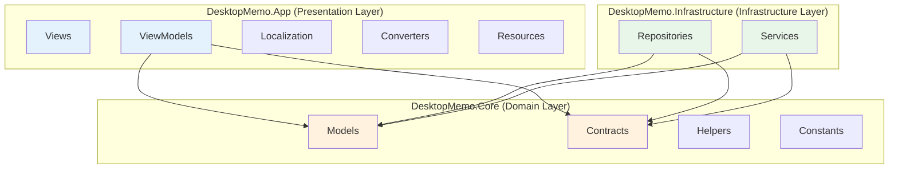
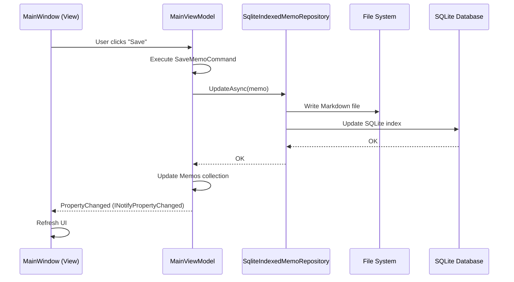
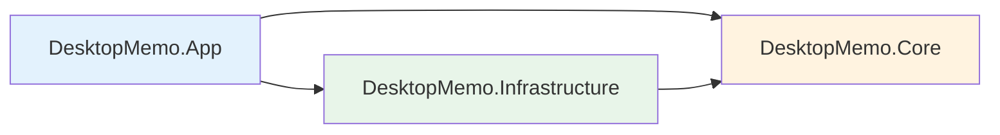

# Module Division (Detailed)

## 1. Module Overview

This project is divided based on a **three-layer architecture** and **DDD (Domain-Driven Design)** principles:



---

## 2. Presentation Layer (DesktopMemo.App)

### 2.1 Views

Responsibilities: define the UI.

Key files:
- `MainWindow.xaml` / `MainWindow.xaml.cs` - main window
- User controls (if any)

Characteristics:
- Uses WPF XAML
- Data-binds to ViewModels
- Contains no business logic
- Handles UI events (e.g., window drag, button clicks)

---

### 2.2 ViewModels

Responsibilities: implement presentation logic and connect Views to domain models.

Core classes:

#### MainViewModel
- Path: `ViewModels/MainViewModel.cs`
- Responsibilities:
  - Memo list management
  - Editor state management
  - Settings management
  - Window state control
- Key properties:
  - `Memos`: memo collection
  - `SelectedMemo`: currently selected memo
  - `EditorContent`: editor content
  - `WindowSettings`: window settings
  - `IsEditMode`: whether in edit mode
- Key commands:
  - `CreateMemoCommand`: create memo
  - `DeleteMemoCommand`: delete memo
  - `SaveMemoCommand`: save memo
  - `ToggleSettingsPanelCommand`: toggle settings panel

#### TodoListViewModel
- Path: `ViewModels/TodoListViewModel.cs`
- Responsibilities: TodoList feature management
- Key properties:
  - `TodoItems`: pending items
  - `CompletedTodoItems`: completed items
- Key commands:
  - `AddTodoCommand`: add item
  - `ToggleTodoCommand`: toggle completion
  - `DeleteTodoCommand`: delete item

#### LogViewModel
- Path: `ViewModels/LogViewModel.cs`
- Responsibilities: log viewing & filtering
- Key properties:
  - `LogEntries`: log entry collection
  - `FilterLevel`: level filter
- Key features:
  - Real-time loading
  - Filter by level
  - Clear logs

Technical characteristics:
- Inherits from `ObservableObject` (CommunityToolkit.Mvvm)
- Uses `[ObservableProperty]` for generated property notifications
- Uses `[RelayCommand]` for generated commands
- Gets services via dependency injection

---

### 2.3 Localization

Responsibilities: multilingual support.

Main components:
- `LocalizationService.cs` - localization service implementation
- `Resources/` - language resource files (e.g., `Strings.zh-CN.json`, `Strings.en-US.json`)

Supported languages:
- Simplified Chinese (zh-CN)
- English (en-US)
- Extendable to more languages

How it works:
- Loads translations from JSON files
- Provides translations through `ILocalizationService`
- Supports switching language at runtime

---

### 2.4 Converters

Responsibilities: value converters for data binding.

Typical converters:
- `BooleanToVisibilityConverter`
- `InverseBooleanConverter`
- `DateTimeToStringConverter`

---

### 2.5 Resources

Responsibilities: themes, styles, icons.

Key files:
- `App.xaml` - global resource dictionary
- `Resources/Themes/` - theme definitions (light/dark)
- `../images/logo.ico` - application icon

---

## 3. Domain Layer (DesktopMemo.Core)

### 3.1 Models

Responsibilities: define business entities.

Core entities:

#### Memo
```csharp
public sealed record Memo(
    Guid Id,
    string Title,
    string Content,
    string Preview,
    DateTimeOffset CreatedAt,
    DateTimeOffset UpdatedAt,
    IReadOnlyList<string> Tags,
    bool IsPinned,
    int Version,
    SyncStatus SyncStatus,
    DateTimeOffset? DeletedAt
)
```
- Immutable record (`record`)
- Methods: `CreateNew()`, `WithContent()`, `WithMetadata()`
- Computed property: `DisplayTitle` (smart title extraction)

#### TodoItem
```csharp
public record TodoItem(
    Guid Id,
    string Content,
    bool IsCompleted,
    DateTimeOffset CreatedAt,
    DateTimeOffset? CompletedAt
)
```

#### WindowSettings
- Window position & size
- Transparency, topmost mode
- Theme, language

#### LogEntry
- Log level (Debug, Info, Warning, Error)
- Timestamp
- Source, message, exception

Enum types:
- `AppTheme`: theme (Light, Dark, System)
- `SyncStatus`: sync status (Synced, PendingSync, Conflict)
- `LogLevel`: log level

---

### 3.2 Contracts

Responsibilities: define interface contracts.

Core interfaces:

#### Data access interfaces
- `IMemoRepository` - memo repository
  ```csharp
  Task<IReadOnlyList<Memo>> GetAllAsync()
  Task<Memo?> GetByIdAsync(Guid id)
  Task AddAsync(Memo memo)
  Task UpdateAsync(Memo memo)
  Task DeleteAsync(Guid id)
  ```

- `ITodoRepository` - todo repository
- `ISettingsService` - settings service
  ```csharp
  Task<WindowSettings> LoadAsync()
  Task SaveAsync(WindowSettings settings)
  ```

#### Business service interfaces
- `IMemoSearchService` - search service
  ```csharp
  Task<IReadOnlyList<Memo>> SearchAsync(string keyword)
  Task<IReadOnlyList<Memo>> GetByTagAsync(string tag)
  ```

- `ILogService` - log service
  ```csharp
  void Debug(string source, string message)
  void Info(string source, string message)
  void Warning(string source, string message)
  void Error(string source, string message, Exception? ex)
  ```

#### UI service interfaces
- `IWindowService` - window service
  ```csharp
  void SetTopmost(bool topmost)
  void SetTransparency(double opacity)
  void SetClickThrough(bool enabled)
  ```

- `ITrayService` - system tray service
  ```csharp
  void Initialize()
  void Show()
  void Hide()
  ```

- `ILocalizationService` - localization service
  ```csharp
  string GetString(string key)
  void ChangeLanguage(string languageCode)
  ```

---

### 3.3 Helpers

Responsibilities: helper utility classes.

Core helpers:

#### DebounceHelper
- Purpose: debounce (delayed execution)
- Use cases: settings save, search input
- Example:
  ```csharp
  _debouncer.Debounce(500, async () => await SaveSettingsAsync());
  ```

#### TransparencyHelper
- Purpose: compute window opacity
- Converts: percentage ↔ opacity value

---

### 3.4 Constants

Responsibilities: define application constants.

Key constants:
- `WindowConstants`
  - default width/height
  - min width/height
  - topmost mode constants

---

## 4. Infrastructure Layer (DesktopMemo.Infrastructure)

### 4.1 Repositories

Responsibilities: data access implementations.

Core implementations:

#### SqliteIndexedMemoRepository
- Path: `Repositories/SqliteIndexedMemoRepository.cs`
- Implements: `IMemoRepository`
- Storage:
  - Markdown files store full content
    - Format: YAML front matter + Markdown body
    - Path: `.memodata/memos/{id}.md`
  - SQLite stores metadata index
    - Table: `memos`
    - Columns: id, title, preview, created_at, updated_at, tags, is_pinned
- Key techniques:
  - Dapper for SQLite access
  - File I/O for Markdown read/write
  - Dual-write strategy (write file first, then update index)

#### SqliteTodoRepository
- Path: `Repositories/SqliteTodoRepository.cs`
- Implements: `ITodoRepository`
- Storage: SQLite-only
  - Table: `todos`
  - Transaction support

#### JsonSettingsService
- Path: `Services/JsonSettingsService.cs`
- Implements: `ISettingsService`
- Storage: JSON file (`.memodata/settings.json`)
- Serialization: `System.Text.Json`

---

### 4.2 Services

Responsibilities: business service implementations.

Core services:

#### MemoSearchService
- Path: `Services/MemoSearchService.cs`
- Implements: `IMemoSearchService`
- Features:
  - Full-text search (title + content)
  - Tag filtering
  - Combined queries (SQLite FTS or LIKE)

#### FileLogService
- Path: `Services/FileLogService.cs`
- Implements: `ILogService`
- Features:
  - Writes logs to file
  - Daily rotation (`.memodata/logs/app-2025-11-15.log`)
  - Async writes (avoid blocking UI)

#### WindowService
- Path: `Services/WindowService.cs`
- Implements: `IWindowService`
- Features:
  - Topmost control (Win32 `SetWindowPos`)
  - Opacity control (WPF `Opacity`)
  - Click-through mode (Win32 `WS_EX_TRANSPARENT`)

#### TrayService
- Path: `Services/TrayService.cs`
- Implements: `ITrayService`
- Features:
  - Tray icon via `System.Windows.Forms.NotifyIcon`
  - Tray menu (show/hide, exit)
  - Restore window on double click

#### Migration services
- `MemoMigrationService`: legacy memo format migrations
- `TodoMigrationService`: JSON → SQLite migration
- `MemoMetadataMigrationService`: index.json → SQLite index migration

Characteristics:
- Automatically checks and runs on startup
- Keeps old files as backup after success
- Writes migration logs

---

## 5. Module Communication



---

## 6. Module Dependencies

### Dependency rules
1. Presentation layer may depend on domain and infrastructure layers
2. Infrastructure layer may depend on domain layer
3. Domain layer does not depend on other layers (pure POCO)

### Dependency graph


---

## 7. Responsibility Matrix

| Module | Create | Read | Update | Delete | Search | Render |
|---|---:|---:|---:|---:|---:|---:|
| **ViewModels** | ✅ | ✅ | ✅ | ✅ | ✅ | ❌ |
| **Views** | ❌ | ❌ | ❌ | ❌ | ❌ | ✅ |
| **Repositories** | ✅ | ✅ | ✅ | ✅ | ✅ | ❌ |
| **Services** | ❌ | ✅ | ❌ | ❌ | ✅ | ❌ |
| **Models** | ❌ | ❌ | ❌ | ❌ | ❌ | ❌ |

---

## 8. Module Extension Guide

### Steps to add a new feature

Example: add a "Memo Categories" feature.

1. Define the domain model (Core/Models)
   ```csharp
   public record Category(Guid Id, string Name, string Color);
   ```

2. Define the interface (Core/Contracts)
   ```csharp
   public interface ICategoryRepository
   {
       Task<IReadOnlyList<Category>> GetAllAsync();
       Task AddAsync(Category category);
   }
   ```

3. Implement the repository (Infrastructure/Repositories)
   ```csharp
   public class SqliteCategoryRepository : ICategoryRepository
   {
       // implement methods
   }
   ```

4. Register the service (App.xaml.cs)
   ```csharp
   services.AddSingleton<ICategoryRepository, SqliteCategoryRepository>();
   ```

5. Add a ViewModel (App/ViewModels)
   ```csharp
   public partial class CategoryViewModel : ObservableObject
   {
       private readonly ICategoryRepository _categoryRepository;
       // ...
   }
   ```

6. Create a view (App/Views)
   - Add `CategoryManagementView.xaml`

---

## 9. Module Maintenance Suggestions

### Most critical modules
1. **MainViewModel** - core application logic
2. **SqliteIndexedMemoRepository** - data persistence
3. **App.xaml.cs** - DI configuration

### Modules that need strong test coverage
1. **Repositories** - data correctness
2. **Migration Services** - upgrade compatibility
3. **WindowService** - Windows version compatibility

### Performance-sensitive modules
1. **MemoSearchService** - search performance with many memos
2. **FileLogService** - avoid blocking UI
3. **MainViewModel** - debounced settings saves

---

**Last Updated**: 2025-11-15
