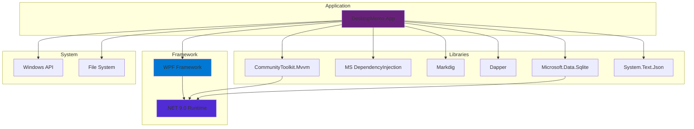

# Technology Stack and Dependencies

## 1. Technology Stack Overview

```mermaid
graph TB
    subgraph "Development Platform"
        NET[.NET 9.0]
        LANG[C# 13.0]
    end

    subgraph "UI Framework"
        WPF[WPF - Windows Presentation Foundation]
        XAML[XAML Markup]
        MVVM[MVVM Toolkit]
    end

    subgraph "Storage"
        SQLite[SQLite Database]
        MD[Markdown Files]
        JSON[JSON Config Files]
    end

    subgraph "Third-Party Libraries"
        CT[CommunityToolkit.Mvvm]
        Dapper[Dapper ORM]
        Markdig[Markdig Markdown]
        DI[MS DependencyInjection]
    end

    NET --> WPF
    WPF --> XAML
    WPF --> MVVM
    MVVM --> CT
    NET --> SQLite
    NET --> MD
    NET --> JSON
    NET --> Dapper
    NET --> Markdig
    NET --> DI

    style NET fill:#512bd4
    style WPF fill:#0078d4
    style SQLite fill:#003b57
    style CT fill:#68217a
```



---

## 2. Core Stack

### 2.1 .NET 9.0

Why:
- Latest LTS version
- Performance improvements and new language features
- Better GC performance
- Native AOT support (future optimization option)

Key features used:
- C# 13.0 features
- `record` types (immutable domain models)
- `async/await`
- Nullable reference types
- `ImplicitUsings`

Runtime environment:
- Target: Windows (`net9.0-windows`)
- Minimum: Windows 10 / Windows 11
- Architectures: x64, x86, ARM64

---

### 2.2 WPF (Windows Presentation Foundation)

Version: shipped with .NET 9.0.

Why:
- Native Windows desktop UI framework
- Strong data binding and MVVM support
- Rich controls and styling system
- Hardware-accelerated rendering (DirectX)

WPF features used:
- Data binding (Binding, INotifyPropertyChanged)
- Command system (ICommand)
- Resource dictionaries & styles
- Attached properties
- Dependency properties

UI components:
- `Window` - main window
- `TextBox` - editor
- `ListBox` / `ListView` - memo list
- `Button`, `CheckBox`, `Slider` - controls
- `Border`, `Grid`, `StackPanel` - layout

---

### 2.3 MVVM Architecture

Framework: CommunityToolkit.Mvvm (v8.4.0)

Core components:
- `ObservableObject`
- `[ObservableProperty]` source generator
- `[RelayCommand]` source generator
- `ObservableCollection<T>`

Example:
```csharp
public partial class MainViewModel : ObservableObject
{
    [ObservableProperty]
    private string _editorContent = string.Empty;

    [RelayCommand]
    private async Task SaveMemoAsync()
    {
        // save logic
    }
}
```

Benefits:
- Less boilerplate
- Compile-time source generation (good performance)
- Type safety
- Testable

---

## 3. Third-Party Dependencies

### 3.1 NuGet Package List

| Package | Version | Purpose | Where used |
|---|---:|---|---|
| **CommunityToolkit.Mvvm** | 8.4.0 | MVVM framework | App, Core |
| **Markdig** | 0.42.0 | Markdown parsing | App, Infrastructure |
| **Dapper** | 2.1.35 | Lightweight ORM | Infrastructure |
| **Microsoft.Data.Sqlite** | 9.0.1 | SQLite driver | Infrastructure |
| **Microsoft.Extensions.DependencyInjection** | 9.0.9 | DI container | App |
| **Microsoft.Extensions.Logging.Abstractions** | 9.0.9 | Logging abstractions | Infrastructure |
| **System.Text.Json** | 9.0.9 | JSON serialization | Infrastructure |

---

### 3.2 Key Dependencies

#### CommunityToolkit.Mvvm

GitHub: https://github.com/CommunityToolkit/dotnet

What it provides:
- Source generators for MVVM code
- `ObservableObject`, `ObservableRecipient`
- `RelayCommand`, `AsyncRelayCommand`
- `ObservableValidator`

Usage:
- All ViewModels inherit from `ObservableObject`
- Declare properties with `[ObservableProperty]`
- Declare commands with `[RelayCommand]`

Alternatives:
- Prism (heavier)
- MVVM Light (unmaintained)
- Manual INotifyPropertyChanged (verbose)

---

#### Dapper

GitHub: https://github.com/DapperLib/Dapper

What it provides:
- Micro ORM (performance close to raw ADO.NET)
- Object mapping (query → C# objects)
- Parameterized queries (SQL injection prevention)

Usage:
```csharp
var memos = await connection.QueryAsync<Memo>(
    "SELECT * FROM memos WHERE is_pinned = @IsPinned",
    new { IsPinned = true }
);
```

Benefits:
- High performance
- Simple and lightweight

Alternatives:
- Entity Framework Core (powerful but heavier)
- ADO.NET (low-level and verbose)

---

#### Markdig

GitHub: https://github.com/xoofx/markdig

What it provides:
- Markdown → HTML conversion
- CommonMark + GitHub Flavored Markdown support
- Extensions (tables, task lists, emoji, etc.)

Usage:
- Parse memo Markdown content
- Extract YAML front matter

Benefits:
- Excellent performance
- Extensible

Alternatives:
- MarkdownSharp (old)
- CommonMark.NET (less feature-rich)

---

#### Microsoft.Data.Sqlite

Docs: https://learn.microsoft.com/en-us/dotnet/standard/data/sqlite/

What it provides:
- Official SQLite ADO.NET driver
- Official .NET integration

Usage:
```csharp
using var connection = new SqliteConnection($"Data Source={dbPath}");
await connection.OpenAsync();
await connection.ExecuteAsync("CREATE TABLE IF NOT EXISTS memos...");
```

Benefits:
- Official support
- Embedded database (no separate process)

Alternatives:
- System.Data.SQLite (community)
- SQLite-net (mobile-oriented)

---

#### Microsoft.Extensions.DependencyInjection

Docs: https://learn.microsoft.com/en-us/dotnet/core/extensions/dependency-injection

What it provides:
- Official DI container
- Constructor injection
- Lifetime management (Singleton, Scoped, Transient)

Usage (App.xaml.cs):
```csharp
var services = new ServiceCollection();
services.AddSingleton<IMemoRepository, SqliteIndexedMemoRepository>();
services.AddSingleton<MainViewModel>();
var serviceProvider = services.BuildServiceProvider();
```

Benefits:
- Official support
- Consistent with ASP.NET Core
- Lightweight

Alternatives:
- Autofac
- Ninject

---

#### System.Text.Json

Docs: https://learn.microsoft.com/en-us/dotnet/standard/serialization/system-text-json/

What it provides:
- Official JSON serializer
- High performance (Span-based)
- Async APIs

Usage:
```csharp
var settings = await JsonSerializer.DeserializeAsync<WindowSettings>(stream);
await JsonSerializer.SerializeAsync(stream, settings, new JsonSerializerOptions
{
    WriteIndented = true
});
```

Benefits:
- Official support
- Faster than Newtonsoft.Json in many cases

Alternatives:
- Newtonsoft.Json

---

## 4. Data Storage

### 4.1 SQLite

Version: latest stable introduced via Microsoft.Data.Sqlite 9.0.1.

Use cases:
1. Memo metadata index (`memos.db`)
   - Table: `memos`
   - Columns: id, title, preview, created_at, updated_at, tags, is_pinned
2. TodoList (`todos.db`)
   - Table: `todos`
   - Columns: id, content, is_completed, created_at, completed_at

Schema:
```sql
-- memos.db
CREATE TABLE memos (
    id TEXT PRIMARY KEY,
    title TEXT NOT NULL,
    preview TEXT,
    created_at TEXT NOT NULL,
    updated_at TEXT NOT NULL,
    tags TEXT,
    is_pinned INTEGER DEFAULT 0
);

-- todos.db
CREATE TABLE todos (
    id TEXT PRIMARY KEY,
    content TEXT NOT NULL,
    is_completed INTEGER DEFAULT 0,
    created_at TEXT NOT NULL,
    completed_at TEXT
);
```

Benefits:
- No server required
- Single-file storage
- ACID transactions
- Full-text search via FTS5

---

### 4.2 Markdown Files

Format: YAML front matter + Markdown body.

Example:
```markdown
---
id: 550e8400-e29b-41d4-a716-446655440000
title: My memo
created_at: 2025-11-15T10:00:00+08:00
updated_at: 2025-11-15T10:30:00+08:00
tags:
  - Work
  - Important
is_pinned: true
---

# Title

Memo content...
```

Storage path: `.memodata/memos/{id}.md`

Benefits:
- Human-readable
- Version-control friendly (Git)
- Editable by external editors
- Data safety: content remains even if SQLite is corrupted

---

### 4.3 JSON Config Files

File: `.memodata/settings.json`

Example:
```json
{
  "windowWidth": 800,
  "windowHeight": 600,
  "windowLeft": 100,
  "windowTop": 100,
  "backgroundOpacity": 0.8,
  "theme": "Light",
  "preferredLanguage": "zh-CN",
  "isAutoStartEnabled": false,
  "topmostMode": "Desktop"
}
```

Benefits:
- Human-readable
- Easy to edit
- Easy to back up

---

## 5. Windows API Usage

### 5.1 Win32 APIs

Use cases:

#### Window positioning/topmost (`SetWindowPos`)
```csharp
[DllImport("user32.dll")]
private static extern bool SetWindowPos(IntPtr hWnd, IntPtr hWndInsertAfter,
    int X, int Y, int cx, int cy, uint uFlags);
```
- Implements desktop-layer topmost and always-on-top

#### Click-through (extended window styles)
```csharp
[DllImport("user32.dll")]
private static extern int SetWindowLong(IntPtr hWnd, int nIndex, int dwNewLong);
```
- Sets `WS_EX_TRANSPARENT`

---

### 5.2 System.Windows.Forms

Use case: system tray integration.

Components:
- `NotifyIcon`
- `ContextMenuStrip`

Code location: `Infrastructure/Services/TrayService.cs`

---

## 6. Development Tools and Environment

### 6.1 IDEs and Editors

Recommended:
- Visual Studio 2022 (v17.12+)
- Visual Studio Code + C# Dev Kit
- JetBrains Rider

Required components:
- .NET 9.0 SDK
- WPF workload

---

### 6.2 Build Tools

Build commands:
```powershell
dotnet restore
dotnet build --configuration Release
dotnet publish -c Release -r win-x64 --self-contained
```

Release script:
- `build_exe.bat` - single-file executable publish script

---

### 6.3 Version Control

Tool: Git

Ignored files: `.gitignore`
- `bin/`, `obj/`, `artifacts/`
- `.memodata/` (user data)
- `.vs/` (Visual Studio settings)

---

## 7. Dependency Graph



---

## 8. External Services and APIs

### 8.1 Current external dependencies

No external network dependencies ✅
- All data is stored locally
- No cloud service integration
- No third-party API calls

### 8.2 Potential future extensions

Cloud sync (reserved design):
- `SyncStatus` enum is defined (Synced, PendingSync, Conflict)
- `Memo.Version` supports versioning
- Can integrate OneDrive, Dropbox, or a self-hosted service

Third-party APIs:
- Markdown rendering services (e.g., GitHub API)
- AI summarization (e.g., OpenAI API)

---

## 9. Technical Debt and Upgrade Plan

### 9.1 Known technical debt

No major technical debt ✅

### 9.2 Future upgrade plans

1. Markdown editor improvements
   - Integrate a rich text editor (e.g., AvalonEdit)
   - Live preview
2. Full-text search improvements
   - SQLite FTS5
   - Pinyin search
3. Performance optimization
   - List virtualization for large memo counts
   - Lazy loading
4. Cross-platform
   - Avalonia UI (macOS/Linux)

---

## 10. Technology Choice Comparison

| Requirement | Chosen technology | Alternatives | Reason |
|---|---|---|---|
| **UI framework** | WPF | WinUI 3, Avalonia | Mature and stable |
| **MVVM** | CommunityToolkit.Mvvm | Prism, MVVM Light | Official support + source generators |
| **Database** | SQLite | LiteDB, JSON files | Standard SQL + performance |
| **ORM** | Dapper | EF Core, ADO.NET | Lightweight and fast |
| **Markdown** | Markdig | CommonMark.NET | Feature-rich + fast |
| **DI container** | MS DI | Autofac, Ninject | Official + lightweight |

---

**Last Updated**: 2025-11-15
