# Data Flow and Communication

## 1. Overview

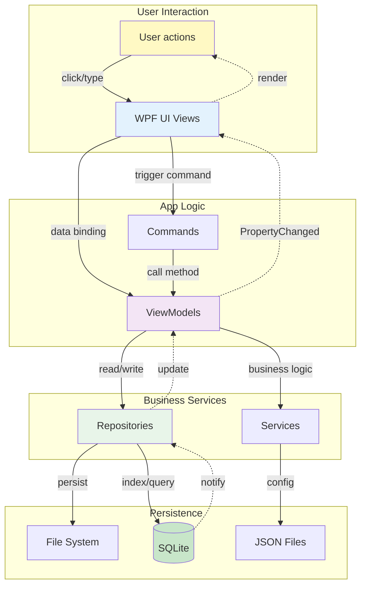

---

## 2. Core Data Flow Scenarios

### 2.1 Application Startup

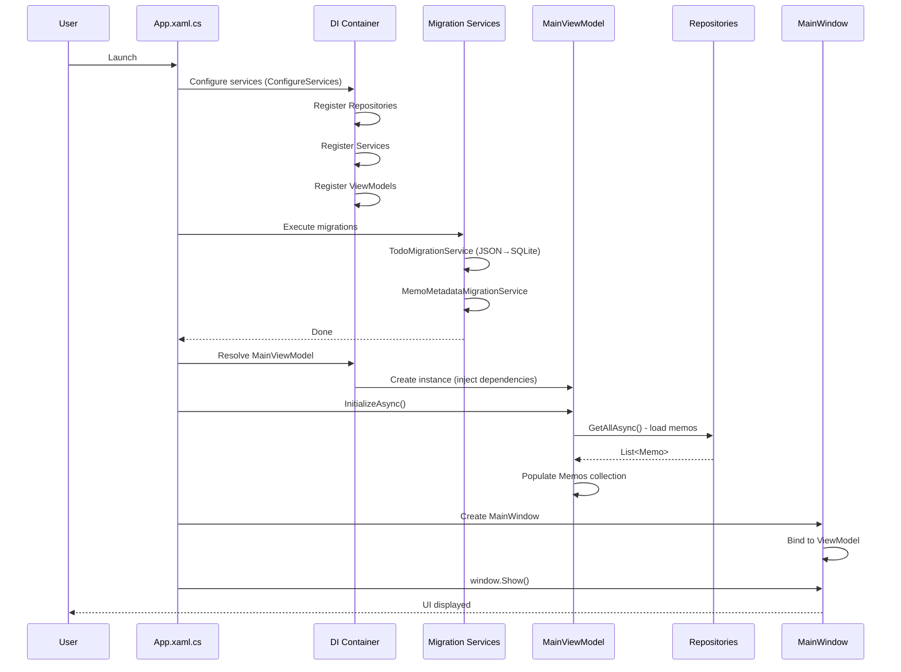

Key steps:
1. DI configuration (`App.xaml.cs:23-54`)
2. Migration check (`App.xaml.cs:73-101`)
3. ViewModel initialization (`MainViewModel.InitializeAsync`)
4. Load memo list (via Repository)
5. Show window

Data sources:
- Memos: `.memodata/memos/*.md` + `memos.db`
- Settings: `.memodata/settings.json`
- TodoList: `todos.db`

---

### 2.2 Create a New Memo

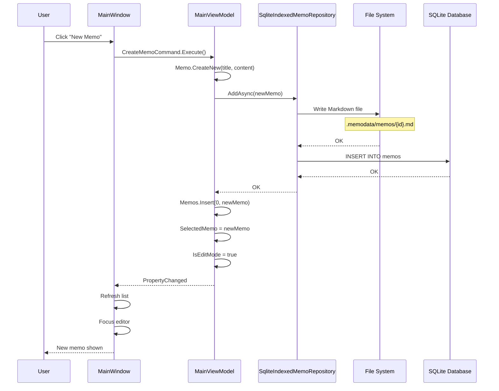

Data flow:
1. UI → ViewModel: command triggered
2. ViewModel → Repository: `AddAsync`
3. Repository → File System: write Markdown file
4. Repository → SQLite: insert metadata index
5. Repository → ViewModel: returns OK
6. ViewModel → UI: property notifications (`INotifyPropertyChanged`)

Files involved:
- `MainViewModel.cs:CreateMemoCommand`
- `SqliteIndexedMemoRepository.cs:AddAsync`
- `.memodata/memos/{guid}.md`
- `.memodata/memos.db`

---

### 2.3 Edit Memo

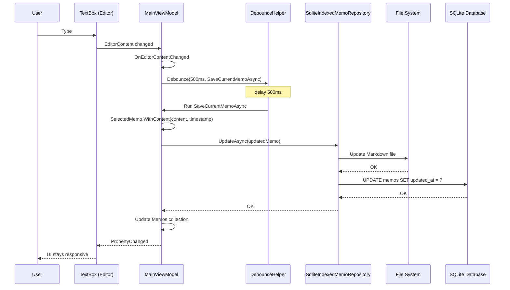

Debounce strategy:
- Delay: 500ms
- Goal: avoid frequent saves (performance)
- Implementation: `Core/Helpers/DebounceHelper.cs`

Synchronization:
- Editor text (`EditorContent`) ← user input
- In-memory model (`SelectedMemo`)
- Markdown file (persistence)
- SQLite index (metadata)

---

### 2.4 Search Memos

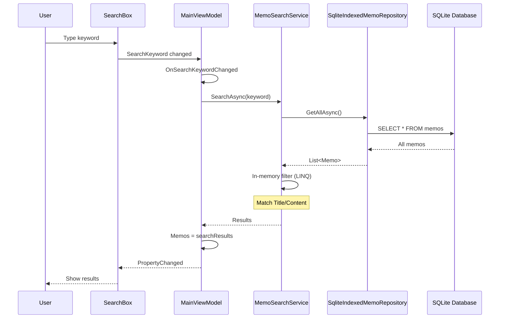

Search strategy:
1. Load all memos from Repository
2. Filter in memory with LINQ
3. Match rules:
   - Title contains keyword
   - Content contains keyword
   - Tags contains keyword

Performance ideas:
- Use SQLite FTS5
- Load only metadata (Title, Preview)
- Lazy-load full content

---

### 2.5 Save Settings

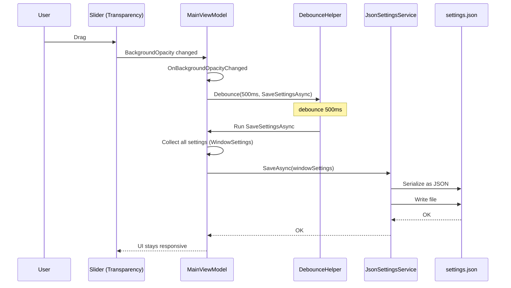

Setting types:
- Window: position, size, transparency
- App: theme, language, auto start
- Topmost mode: desktop / always / normal

Why debounce:
- Slider drag triggers frequent property changes
- Avoid writing file for every tick (I/O is expensive)
- Save after 500ms idle

Atomic save:
```csharp
var tempPath = settingsPath + ".tmp";
await File.WriteAllTextAsync(tempPath, json);
File.Move(tempPath, settingsPath, overwrite: true);
```

---

### 2.6 TodoList Data Flow

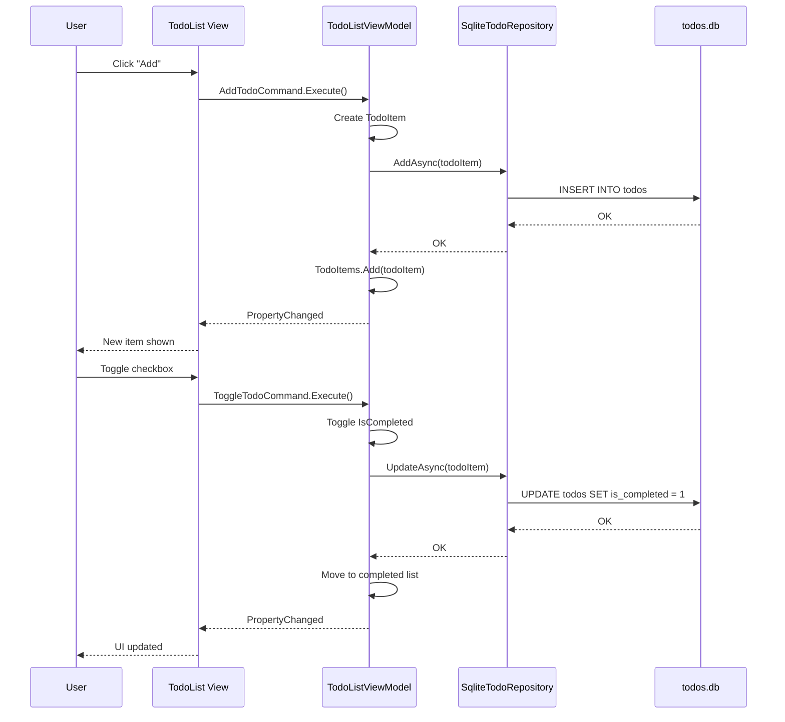

Characteristics:
- SQLite-only storage (no files)
- Transaction support
- Two-list management:
  - `TodoItems`
  - `CompletedTodoItems`

---

## 3. Storage Strategy

### 3.1 Dual Storage Design for Memos

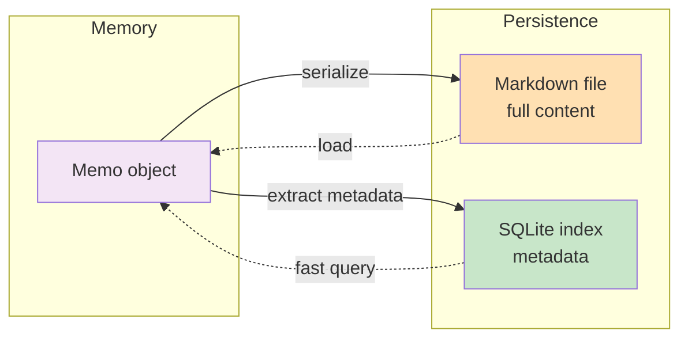

Why dual storage?

1. Markdown files (source of truth)
   - ✅ Human-readable
   - ✅ Version-control friendly
   - ✅ Editable with external editors
   - ✅ Data safety (even if SQLite breaks)
   - ❌ Slow to query (file traversal)

2. SQLite index (performance)
   - ✅ Fast queries (SQL)
   - ✅ Sorting & filtering
   - ✅ Full-text search (FTS5)
   - ❌ Binary format (not directly editable)

Sync strategy:
```csharp
await File.WriteAllTextAsync(filePath, markdown); // write file first
await _db.ExecuteAsync("INSERT INTO memos...");   // then update index

var metadata = await _db.QueryAsync<Memo>("SELECT * FROM memos"); // read index
var content = await File.ReadAllTextAsync(filePath);              // read full content
```

---

### 3.2 Data Consistency Guarantees

Problem: what if the Markdown file write succeeds, but SQLite insert fails?

Solutions:

#### Option 1: Dual-write + rollback
```csharp
await File.WriteAllTextAsync(filePath, markdown);
try
{
    await _db.ExecuteAsync("INSERT INTO memos...");
}
catch
{
    File.Delete(filePath); // rollback file write
    throw;
}
```

#### Option 2: Startup repair
```csharp
var filesOnDisk = Directory.GetFiles(".memodata/memos", "*.md");
var idsInDb = await _db.QueryAsync<string>("SELECT id FROM memos");

var missingInDb = filesOnDisk.Except(idsInDb);
foreach (var id in missingInDb)
{
    var memo = await ParseMarkdownFile(id);
    await _db.ExecuteAsync("INSERT INTO memos...");
}
```

Current implementation: Option 1 (dual-write + exception handling).

---

### 3.3 Concurrency Control

Problem: what if multiple operations modify the same memo at the same time?

Current strategy:
- Single-threaded UI: all UI operations are on the WPF UI thread
- No user-level concurrency: user edits one memo at a time

Future (cloud sync):
- Use `Version` for optimistic concurrency
- Conflict check: `WHERE id = ? AND version = ?`
- Mark conflicts as `SyncStatus.Conflict`

---

## 4. Async Data Flow

### 4.1 Async programming pattern

Rule: avoid `async void` and use fire-and-forget patterns where appropriate.

Bad example:
```csharp
private async void Button_Click(object sender, RoutedEventArgs e)
{
    await SaveMemoAsync(); // ❌ hard to observe errors; can lead to subtle issues
}
```

Good example:
```csharp
private void Button_Click(object sender, RoutedEventArgs e)
{
    _ = Task.Run(async () => await SaveMemoAsync()); // ✅ fire-and-forget
}
```

Async commands in ViewModels:
```csharp
[RelayCommand]
private async Task SaveMemoAsync() // ✅ return Task
{
    await _repository.UpdateAsync(SelectedMemo);
}
```

---

### 4.2 Thread switching

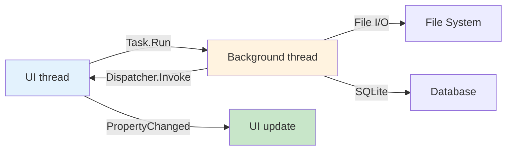

Example:
```csharp
private async Task LoadMemosAsync()
{
    var memos = await Task.Run(async () =>
        await _repository.GetAllAsync());

    Memos = new ObservableCollection<Memo>(memos);
}
```

---

## 5. Event-Driven Data Flow

### 5.1 Property change notifications

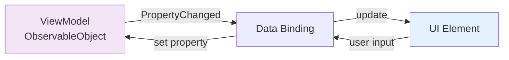

Implementation:
```csharp
public partial class MainViewModel : ObservableObject
{
    [ObservableProperty]
    private string _editorContent = string.Empty;

    // generated:
    public string EditorContent
    {
        get => _editorContent;
        set
        {
            if (_editorContent != value)
            {
                _editorContent = value;
                OnPropertyChanged(nameof(EditorContent));
            }
        }
    }
}
```

XAML binding:
```xml
<TextBox Text="{Binding EditorContent, UpdateSourceTrigger=PropertyChanged}" />
```

---

### 5.2 Collection change notifications

`ObservableCollection`:
```csharp
public ObservableCollection<Memo> Memos { get; } = new();

Memos.Add(newMemo);
Memos.Remove(oldMemo);
Memos[0] = updatedMemo;
```

Notes:
- Implements `INotifyCollectionChanged`
- WPF binding listens to `CollectionChanged` and updates UI automatically

---

## 6. Key Design Patterns in the Data Flow

### 6.1 Repository pattern

Purpose: encapsulate data access.

```csharp
// contract (Core)
public interface IMemoRepository
{
    Task<IReadOnlyList<Memo>> GetAllAsync();
    Task AddAsync(Memo memo);
}

// implementation (Infrastructure)
public class SqliteIndexedMemoRepository : IMemoRepository
{
    public async Task<IReadOnlyList<Memo>> GetAllAsync()
    {
        // load from SQLite + Markdown
    }
}

// usage (App)
public class MainViewModel
{
    private readonly IMemoRepository _repository;

    public MainViewModel(IMemoRepository repository)
    {
        _repository = repository;
    }
}
```

---

### 6.2 Unidirectional data flow

```mermaid
graph TB
    User[User action] -->|1. trigger| Command[Command]
    Command -->|2. call| VM[ViewModel method]
    VM -->|3. update| Model[Model]
    Model -->|4. persist| Storage[Storage layer]
    Storage -.5. return.-> VM
    VM -.6. PropertyChanged.-> UI[UI update]
    UI -.7. render.-> User

    style User fill:#fff9c4
    style Command fill:#f3e5f5
    style VM fill:#e1bee7
    style Storage fill:#c8e6c9
    style UI fill:#e3f2fd
```

Benefits:
- Clear flow
- Easier debugging and testing
- Avoid complexity of two-way state mutations

---

### 6.3 Debounce pattern

Purpose: reduce execution frequency for high-frequency events.

```csharp
// DebounceHelper.cs
public class DebounceHelper
{
    private CancellationTokenSource? _cts;

    public void Debounce(int delayMs, Action action)
    {
        _cts?.Cancel();
        _cts = new CancellationTokenSource();

        Task.Delay(delayMs, _cts.Token)
            .ContinueWith(_ => action(),
                TaskScheduler.FromCurrentSynchronizationContext());
    }
}
```

Use cases:
- Editor autosave (500ms)
- Search box input (300ms)
- Settings sliders (500ms)

---

## 7. Exception Handling in the Data Flow

### 7.1 Layered exception handling

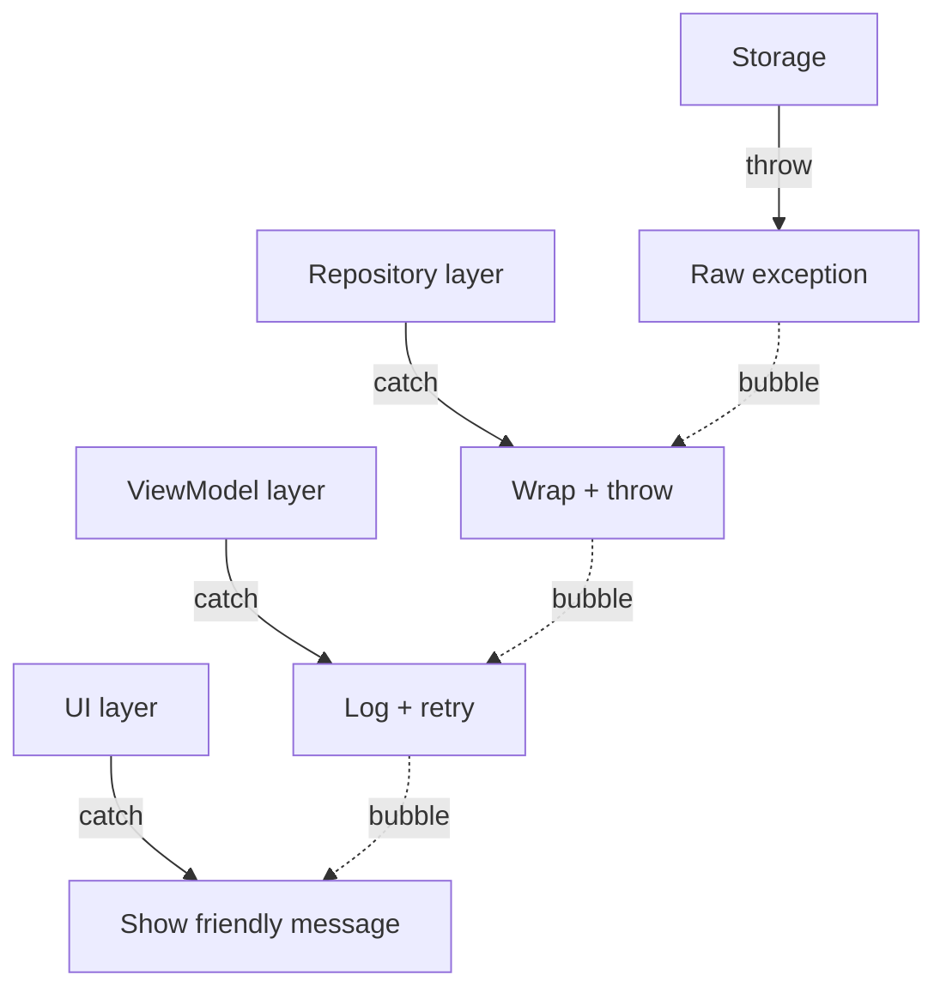

Example:
```csharp
// Repository
public async Task AddAsync(Memo memo)
{
    try
    {
        await File.WriteAllTextAsync(path, content);
    }
    catch (IOException ex)
    {
        throw new DataAccessException("Cannot write memo file", ex);
    }
}

// ViewModel
[RelayCommand]
private async Task SaveMemoAsync()
{
    try
    {
        await _repository.UpdateAsync(SelectedMemo);
    }
    catch (DataAccessException ex)
    {
        _logService.Error("MainViewModel", "Save failed", ex);
        // notify user
    }
}
```

---

## 8. Data Flow Performance Optimization

### 8.1 Lazy loading

Strategy: load full content only when needed.

```csharp
var memos = await _db.QueryAsync<Memo>("SELECT id, title, preview FROM memos");
var content = await File.ReadAllTextAsync($".memodata/memos/{id}.md");
```

---

### 8.2 List virtualization (not implemented)

Suggestion: when memo count exceeds ~1000.
```xml
<ListBox VirtualizingPanel.IsVirtualizing="True"
         VirtualizingPanel.VirtualizationMode="Recycling" />
```

---

### 8.3 Caching

Current: in-memory cache (`ObservableCollection`).
```csharp
public ObservableCollection<Memo> Memos { get; } = new();
```

Future optimization: LRU cache
- Cache only the most recently used 100 items
- Load the rest on demand

---

## 9. Data Flow Security

### 9.1 SQL injection prevention

Use parameterized queries:
```csharp
await _db.ExecuteAsync(
    "INSERT INTO memos (id, title) VALUES (@Id, @Title)",
    new { Id = memo.Id, Title = memo.Title });
```

Avoid string interpolation:
```csharp
await _db.ExecuteAsync(
    $"INSERT INTO memos (id, title) VALUES ('{memo.Id}', '{memo.Title}')");
```

---

### 9.2 File path safety

Validate file names:
```csharp
var fileName = $"{memo.Id}.md";
if (fileName.Contains("..") || fileName.Contains("/") || fileName.Contains("\\"))
{
    throw new SecurityException("Invalid file name");
}
var fullPath = Path.Combine(_dataDirectory, "memos", fileName);
```

---

## 10. Monitoring and Debugging

### 10.1 Logging

Key nodes:
```csharp
_logService.Debug("MainViewModel", $"Start loading memos");
var memos = await _repository.GetAllAsync();
_logService.Info("MainViewModel", $"Loaded {memos.Count} memos");
```

Log location: `.memodata/logs/app-{date}.log`

---

### 10.2 Debug output

```csharp
System.Diagnostics.Debug.WriteLine($"[MainViewModel] Saving memo: {memo.Id}");
```

View in: Visual Studio Output window.

---

## 11. Summary

### Core data flow path

1. User input → UI (WPF)
2. UI → ViewModel (binding/commands)
3. ViewModel → Repository/Service
4. Repository → File system / SQLite
5. Persistence OK → ViewModel
6. ViewModel → UI (property notifications)
7. UI → user (render)

### Design principles

- ✅ Unidirectional data flow
- ✅ Layered architecture
- ✅ Dependency inversion (interfaces in Core)
- ✅ Async-first (avoid blocking UI)
- ✅ Debounce optimizations
- ✅ Layered exception handling
- ✅ Logging at key nodes

---

**Last Updated**: 2025-11-15
